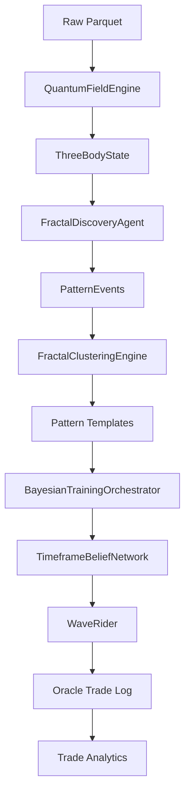

# Bayesian-AI — Architecture Reference
> Auto-generated by Jules on 2026-03-05. Do not edit manually.

## System Overview
Bayesian-AI is a physics-based, fractal trading system that models the market as a three-body quantum problem (Fair Value, +2σ Resistance, -2σ Support). It uses a "Bayesian Brain" to learn the win probability of specific market states (patterns) and a "Fractal DNA" system to align signals across 8 timeframe levels (1h down to 15s).

The system operates in phases: discovering raw physics events, clustering them into "Tight Templates," optimizing trade parameters via Design of Experiments (DOE), and executing a forward pass simulation to validate performance. It features a "Timeframe Belief Network" where 8 independent workers vote on direction, ensuring trades are taken only when the "Golden Path" of conviction is aligned.

## Phase Pipeline
| Phase | Name | File | Description |
|-------|------|------|-------------|
| 1 | Data Prep | `training/dbn_to_parquet.py` | Converts Databento DBN to Parquet ATLAS format |
| 2 | Pattern Discovery | `training/fractal_discovery_agent.py` | Scans history for physics events (Roche Limit, Structural Drive) |
| 3 | Template Optimization | `training/fractal_clustering.py` | Clusters events into templates; optimizes params via DOE |
| 4 | Forward Pass | `training/orchestrator.py` | Replays history using the Playbook (WaveRider execution) |
| 5 | Strategy Selection | `training/trade_analytics.py` | Analyzes results to rank templates (Tier 1-4) |

## Core Files
| File | Class / Function | Role |
|------|-----------------|------|
| `core/quantum_field_engine.py` | `QuantumFieldEngine` | Computes 3-body state, forces, and wave function |
| `core/bayesian_brain.py` | `BayesianBrain` | Hash-map learning engine (State -> WinProb) |
| `core/three_body_state.py` | `ThreeBodyQuantumState` | Dataclass defining the full 16D market state |
| `core/dynamic_binner.py` | `DynamicBinner` | Discretizes continuous features for state hashing |
| `training/orchestrator.py` | `BayesianTrainingOrchestrator` | Main pipeline controller and simulation loop |
| `training/fractal_clustering.py` | `FractalClusteringEngine` | Recursive K-Means clustering of patterns |
| `training/timeframe_belief_network.py` | `TimeframeBeliefNetwork` | 8-worker consensus engine for path conviction |
| `training/wave_rider.py` | `WaveRider` | Execution logic: entries, dynamic trails, CST checks |
| `training/trade_analytics.py` | `_ols_with_stats` | Statistical suite for trade analysis |
| `visualization/live_training_dashboard.py` | `FractalDashboard` | Real-time Tkinter visualization of the manifold |

## Key Constants & Parameters
| Constant | Value | Description |
|----------|-------|-------------|
| `RISK_THETA` | 0.1 | Nightmare protocol mean-reversion force coefficient (`quantum_field_engine.py`) |
| `CST_FALLBACK_SIGMA_THRESHOLD` | 4.5 | Backup threshold for Coherent Structure Tether checks (`wave_rider.py`) |
| `INITIAL_CLUSTER_DIVISOR` | 100 | Ratio of raw patterns to initial clusters (`orchestrator.py`) |

## CLI Reference
| Flag | Default | Description |
|------|---------|-------------|
| `--data` | `DATA/ATLAS` | Path to ATLAS root, single TF directory, or parquet file |
| `--iterations` | `1000` | Iterations per pattern |
| `--checkpoint-dir` | `checkpoints` | Checkpoint directory |
| `--no-dashboard` | `False` | Disable all UI (popup and dashboard) |
| `--dashboard` | `False` | Show full live dashboard instead of default lightweight popup |
| `--skip-deps` | `False` | Skip dependency check |
| `--exploration-mode` | `False` | Enable unconstrained exploration mode |
| `--fresh` | `False` | Clear all pipeline checkpoints and start fresh |
| `--forward-pass` | `False` | Run Phase 4 forward pass using existing playbook |
| `--depth-iso` | `False` | Run per-depth isolation analysis |
| `--oos` | `False` | Blind out-of-sample simulation: frozen templates |
| `--account-size` | `0.0` | Starting account equity in USD |
| `--train-end` | `None` | Out-of-sample guard: cap training data at this date |
| `--forward-start` | `None` | First day to include in forward pass |
| `--forward-end` | `None` | Last day to include in forward pass |
| `--min-tier` | `None` | Only activate templates of this tier or better |
| `--bias-threshold` | `None` | Oracle bias threshold for direction lock |
| `--dmi-threshold` | `None` | Min \|dmi_diff\| required to use DMI signal |
| `--sweep-params` | `False` | Post-hoc DOE: sweep filter combinations |

## Data Flow

## Output Files
| File | Location | Description |
|------|----------|-------------|
| `oracle_trade_log.csv` | `checkpoints/` | Per-trade oracle log |
| `phase4_report.txt` | `checkpoints/` | Forward pass report |
| `trade_analytics.txt` | `checkpoints/ + run_logs/` | Statistical suite |
| `pattern_library.pkl` | `checkpoints/` | Serialized cluster templates and parameters |
| `depth_weights.json` | `checkpoints/` | Learned weights for each fractal depth |
