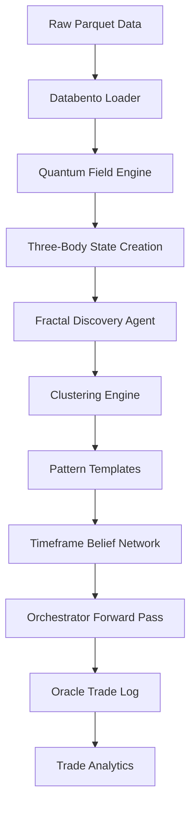

# Bayesian-AI — Architecture Reference
> Auto-generated by Jules on 2026-03-04. Do not edit manually.

## System Overview
Bayesian-AI is a multi-timeframe trading system driven by a quantum-field metaphor for market dynamics. It analyzes high-frequency tick data across a multi-layered fractal time cascade to generate, cluster, and match price trajectory patterns. The architecture relies heavily on recursive K-Means clustering and Monte Carlo tree search, backed by a fast Numba/CUDA-accelerated numerical core.

By representing market context mathematically as a Three-Body Quantum State (with components for price fair value, volatility extremes, and multi-scale momentum), the engine groups similar historical market environments into Archetypal Centroids (Pattern Templates). During forward passes, real-time measurements are scored against these templates to establish robust entries, validate direction using time-weighted Belief Networks, and execute dynamic exit strategies using a Wave Rider protocol.

## Phase Pipeline
| Phase | Name | File | Description |
|-------|------|------|-------------|
| 1 | Data Prep | `training/databento_loader.py` | Load Databento historical parquet files into multi-timeframe generators. |
| 2 | Pattern Discovery | `training/fractal_discovery_agent.py` | Detect patterns dynamically via wave analysis and generate 16D state vectors. |
| 3 | Template Optimization | `training/fractal_clustering.py` | K-Means clustering of patterns to form `PatternTemplate` models per trajectory. |
| 4 | Forward Pass | `training/orchestrator.py` | Replay history through templates to simulate performance and log trades. |
| 5 | Strategy Selection | `training/trade_analytics.py` | Post-pass analysis to select winning templates and generate regression profiles. |

## Core Files
| File | Class / Function | Role |
|------|-----------------|------|
| `core/quantum_field_engine.py` | `QuantumFieldEngine` | Computes quantum wave functions and gravitational fields for price data. |
| `core/bayesian_brain.py` | `BayesianBrain` | Hash-based learning memory that logs state outcomes over time. |
| `core/three_body_state.py` | `ThreeBodyQuantumState` | Complete 16D state representation combining physics, trends, and risk metrics. |
| `core/dynamic_binner.py` | `DynamicBinner` | Fits and maps continuous float variables to histogram centers to define bounded context hashes. |
| `training/orchestrator.py` | Orchestration Entry | Executes Walk-forward training, dashboard hosting, clustering and parameter sweeps. |
| `training/fractal_clustering.py`| `FractalClusteringEngine` | Defines recursive K-means flow to separate massive state datasets. |
| `training/timeframe_belief_network.py` | `TimeframeBeliefNetwork`| Fuses prediction signals from 15s to 1h timeframes using a geometric mean cascade. |
| `training/wave_rider.py` | `WaveRider` | Manages active trade bounds, regret analysis, and calculates dynamic stop-loss adjustments. |
| `training/trade_analytics.py` | Trade Analysis | Conducts T-tests, ANOVA, and regressions on oracle trade logs to identify edges. |
| `visualization/live_training_dashboard.py` | `Tooltip` / UX Widgets | Renders multi-pane Tkinter application to display realtime Pareto stats and heatmaps. |

## Key Constants & Parameters
| Constant / Value | Description |
|------------------|-------------|
| `VELOCITY_CASCADE_THRESHOLD = 1.0` | Points per second limit for initiating a velocity cascade. |
| `RANGE_CASCADE_THRESHOLD = 10.0` | Points range required in a single candle for cascade detection. |
| `RISK_THETA = 0.1` | Baseline parameter for risk engine configuration. |
| `DEFAULT_PID_KP = 0.5` | Default Proportional term for PID shadow analysis. |
| `DEFAULT_PID_KI = 0.1` | Default Integral term for PID shadow analysis. |
| `DEFAULT_PID_KD = 0.2` | Default Derivative term for PID shadow analysis. |
| `FISSION_SUBSET_SIZE = 10` | Default batch size subset for fission testing. |
| `INDIVIDUAL_OPTIMIZATION_ITERATIONS = 5` | Number of cycles during individual target optimizations. |
| `CST_FALLBACK_SIGMA_THRESHOLD = 4.5` | Sigma boundary beyond which CST triggers emergency trail limits. |
| `TRANSITION_MIN_SEQUENCE_GAP_BARS = X` | Min bars between valid macro state transition sequences (configured in oracle_config). |
| `TRANSITION_MAX_SEQUENCE_GAP_BARS = Y` | Max bars between valid macro state transition sequences. |

## CLI Reference
| Flag | Default | Description |
|------|---------|-------------|
| `--forward-pass` | False | Run a standalone forward pass using the existing knowledge playbook. |
| `--dashboard` | False | Run the visualization dashboard locally during execution. |
| `--sweep-params` | False | Sweep combinations of min_tier, direction, noise filters over oracle trade log. |
| `--symbol` | MNQ | Ticker symbol to run analysis against (e.g. MNQ or NQ). |

## Data Flow

## Output Files
| File | Location | Description |
|------|----------|-------------|
| `oracle_trade_log.csv` | `checkpoints/` | Per-trade log detailing every system entry and exit. |
| `phase4_report.txt` | `checkpoints/` | Extensive summary text output of latest forward pass. |
| `trade_analytics.txt` | `checkpoints/` & `run_logs/` | Detailed statistical suite results comparing variables. |
| `pattern_library_long.pkl`| `checkpoints/` | Cached model state for clustered LONG trajectory templates. |
