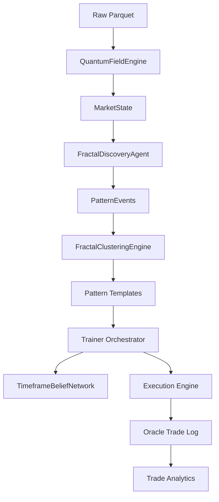

# Bayesian-AI — Architecture Reference
> Auto-generated by Jules on 2026-03-08. Do not edit manually.

## System Overview
Bayesian-AI is a physics-based, fractal trading system that models the market as a three-body quantum problem (Fair Value, +2σ Resistance, -2σ Support). It integrates Nightmare Protocol gravity calculations and utilizes a "Bayesian Brain" to learn the win probability of specific market states (patterns). It leverages a "Fractal DNA" system to align signals across 8 timeframe levels (1h down to 15s).

The system operates in phases: discovering raw physics events, clustering them into "Tight Templates," optimizing trade parameters via Design of Experiments (DOE), and executing a forward pass simulation to validate performance. It features a "Timeframe Belief Network" where independent workers vote on direction, ensuring trades are taken only when the "Golden Path" of conviction is aligned.

## Phase Pipeline
| Phase | Name | File | Description |
|-------|------|------|-------------|
| 1 | Data Prep | `training/dbn_to_parquet.py` | Converts Databento DBN to Parquet ATLAS format |
| 2 | Pattern Discovery | `training/fractal_discovery_agent.py` | Scans history for physics events (Roche Limit, Structural Drive) |
| 3 | Template Optimization | `core/fractal_clustering.py` | Clusters events into templates mapping raw physics events into Archetypal Centroids |
| 4 | Forward Pass | `training/trainer.py` | Replays history using Walk-forward training (Pattern-Adaptive) and Orchestrator logic |
| 5 | Strategy Selection | `training/trade_analytics.py` | Analyzes results to rank templates (Tier 1-4) |

## Core Files
| File | Class / Function | Role |
|------|-----------------|------|
| `core/quantum_field_engine.py` | `QuantumFieldEngine` | Computes 3-body state, forces, and wave function |
| `core/bayesian_brain.py` | `BayesianBrain` | Hash-map learning engine (State -> WinProb) |
| `core/three_body_state.py` | `MarketState` | Dataclass defining the full market state |
| `core/dynamic_binner.py` | `DynamicBinner` | Discretizes continuous features for state hashing |
| `training/trainer.py` | `Trainer` | Main pipeline controller, walk-forward training, and simulation loop |
| `core/fractal_clustering.py` | `FractalClusteringEngine` | Recursive K-Means clustering of patterns using 16D feature vectors |
| `training/timeframe_belief_network.py` | `TimeframeBeliefNetwork` | 8-worker consensus engine for path conviction |
| `visualization/dashboard.py` | `Fractal Command Center` | Real-time Tkinter visualization of the manifold, profit gap pareto charts |

## Feature Vector Space (16D)
The `PatternTemplate` utilizes a 16D feature space that includes:
- `|z_score|`, `|velocity|`, `|momentum|`, `coherence`, `log2(tf_seconds)`, `depth`
- `parent_is_roche`, `self_adx`, `self_hurst`, `self_dmi_diff`, `parent_z`
- `parent_dmi_diff`, `root_is_roche`, `tf_alignment`, `self_pid`, `self_osc_coh`

This allows the clustering to naturally separate patterns that look similar in physics but live at different fractal scales or regimes.

## Key Concepts & Parameters
| Concept | Description |
|---------|-------------|
| **PID Oscillation** | PID control force and oscillation_coherence mapped directly in the feature space (`term_pid`, `oscillation_coherence`) |
| **Fractal Timescales** | Timeframe scale mapping and alignment (e.g., `TIMEFRAME_SECONDS`) ensures physical continuity |
| **Statistical Validation** | Use of Optional Integrated Statistical Systems and Monte Carlo Analysis |
| **GPU Acceleration** | Core CUDA Physics fallback support for patterns and KMeans (`training/cuda_kmeans.py`) |
| **Transition Maps** | Markov-based inter-template transitions tracking expected values per template |

## Data Flow

## Output Files
| File | Location | Description |
|------|----------|-------------|
| `oracle_trade_log.csv` | `checkpoints/` | Detailed per-trade log with entry/exit metrics |
| `phase4_report.txt` | `checkpoints/` | Summary of the forward pass simulation |
| `trade_analytics.txt` | `run_logs/` | Deep-dive statistical analysis of trades |
| `pid_oracle_log.csv` | `checkpoints/` | Output for PID oscillation analysis and tensor state logs |
| `pattern_library.pkl` | `checkpoints/` | Serialized cluster templates and parameters |
