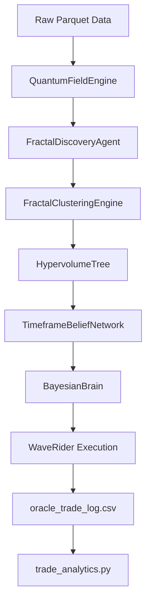

# Bayesian-AI — Architecture Reference
> Auto-generated by Jules on 2026-02-27. Do not edit manually.

## System Overview
Bayesian-AI is a high-frequency trading simulation and strategy optimization system built for market microstructure analysis. It implements a unique physics-inspired model ("Nightmare Protocol" / Three-Body Dynamics) mapped onto financial data via the `QuantumFieldEngine`. The system computes states across multiple timeframes (1h down to 1s), identifying fractal structures and grouping them using a custom `HypervolumeTree` geometric clustering approach.

A Bayesian learning component keeps track of pattern win rates, and a multi-timeframe belief network aggregates directional probabilities and expected magnitude across 8 levels. The `WaveRider` execution engine applies adaptive, physics-aware trailing stops.

## Phase Pipeline
| Phase | Name | File | Description |
|-------|------|------|-------------|
| 1 | Data Prep | `dbn_to_parquet.py` | Ingests Databento DBN files, applies front-month stitching, converts to Parquet. |
| 2 | Pattern Discovery | `fractal_discovery_agent.py` | Top-down hierarchical scanner extracting 16D feature vectors representing market structure. |
| 3 | Template Optimization | `fractal_clustering.py` | I-MR geometric segmentation + DBSCAN to build Hypervolume Trees from pattern events. |
| 4 | Forward Pass | `orchestrator.py` | Replays history, applying strategy playbook via WaveRider and logging trade metrics. |
| 5 | Strategy Selection | `trade_analytics.py` | Ranks strategy templates based on Sharpe, drawdown, and win rate to build a production playbook. |

## Core Files
| File | Class / Function | Role |
|------|-----------------|------|
| `core/quantum_field_engine.py` | `QuantumFieldEngine` | Vectorized CPU/GPU engine for Three-Body state computation, ADX, Hurst. |
| `core/bayesian_brain.py` | `BayesianBrain` | HashMap-based Bayesian probability engine learning WinRate from StateVectors. |
| `core/three_body_state.py` | `ThreeBodyQuantumState`| Dataclass modeling price as a particle interacting with fair-value and sigma limits. |
| `core/dynamic_binner.py` | `DynamicBinner` | Freedman-Diaconis dynamic binning mapping continuous values to nearest bin centers. |
| `training/orchestrator.py` | `BayesianTrainingOrchestrator` | Central entrypoint managing the walk-forward training, simulation, and report generation. |
| `training/fractal_clustering.py` | `FractalClusteringEngine` | Geometric shape-based partitioning via IMR charts and DBSCAN sub-clustering. |
| `training/fractal_dna_tree.py` | `FractalDNATree` | Hierarchical fractal cluster tree determining the ancestry/DNA path of market patterns. |
| `training/timeframe_belief_network.py` | `TimeframeBeliefNetwork` | N workers at different timeframes calculating path conviction for direction. |
| `training/wave_rider.py` | `WaveRider` | Position management system with adaptive trailing stops and regret analysis. |
| `training/trade_analytics.py` | `run_trade_analytics` | Post-run statistical analysis (t-tests, ANOVA, linear/logistic regression on trade log). |
| `visualization/live_training_dashboard.py` | `FractalDashboard` | Tkinter + Matplotlib dashboard for live PnL, Pareto charts, and system monitoring. |

## Key Constants & Parameters
| Constant | Current Value | Description |
|----------|---------------|-------------|
| `DIRECTION_CONFIDENCE_THRESHOLD` | `0.05` | Minimum direction confidence (probability - 0.5) to enter a trade. |
| `CONVICTION_SL_MULTIPLIER` | `0.5` | Scales initial stop-loss ticks for high conviction setups. |
| `CONSENSUS_CONFIDENCE_THRESHOLD` | `0.60` | Minimum multi-signal consensus confidence needed for trade validation. |
| `IMR_Z_THRESHOLD` | `1.0` | Composite signal threshold for IMR shape-based segmentation. |
| `TIGHTEN_TRAIL_WAVE_MATURITY_THRESHOLD` | `0.85` | Deep wave maturity needed to tighten trailing stop. |
| `DEFAULT_BASE_SLIPPAGE` | `0.25` | Base slippage penalty applied to executions. |
| `R2_STOP_THRESHOLD` | `0.90` | Adjusted R² target for halting recursive tree splitting. |
| `MIN_GROUP_SIZE` | `30` | Minimum pattern group size before falling back to aggregation. |

## CLI Reference
| Flag | Default | Description |
|------|---------|-------------|
| `--data` | `DATA/ATLAS` | Path to ATLAS root, single TF directory, or parquet file |
| `--iterations` | `1000` | Iterations per pattern |
| `--checkpoint-dir` | `checkpoints` | Checkpoint directory |
| `--no-dashboard` | `false` | Disable all UI (popup and dashboard) |
| `--dashboard` | `false` | Show full live dashboard instead of default lightweight popup |
| `--skip-deps` | `false` | Skip dependency check |
| `--exploration-mode` | `false` | Enable unconstrained exploration mode |
| `--fresh` | `false` | Clear all pipeline checkpoints and start fresh |
| `--forward-pass` | `false` | Run Phase 4 forward pass using existing playbook |
| `--train-only` | `false` | Run Phases 2-3 only, skips forward pass and strategy report |
| `--oos` | `false` | Standalone OOS rerun (Phase 6 only) |
| `--skip-oos` | `false` | Skip the auto-chained OOS forward pass |
| `--account-size` | `0.0` | Starting account equity in USD (gates trades based on margin) |
| `--train-end` | `None` | Out-of-sample guard: cap training data at this date |
| `--forward-data` | `None` | Separate ATLAS root for Phase 4 forward pass |
| `--forward-start` | `None` | First day to include in forward pass |
| `--forward-end` | `None` | Last day to include in forward pass |
| `--telemetry` | `false` | Print per-trade decision telemetry |
| `--min-tier` | `None` | Only activate templates of this tier or better (1-4) |
| `--bias-threshold` | `None` | Oracle bias threshold for direction lock |
| `--dmi-threshold` | `None` | Min \|dmi_diff\| required to use DMI signal |
| `--r2-target` | `0.90` | Adj-R2 target for DOE convergence |
| `--sweep-params` | `false` | Post-hoc DOE sweep on `oracle_trade_log.csv` |
| `--strategy-report` | `false` | Run Phase 5 strategy selection report |

## Data Flow

## Output Files
| File | Location | Description |
|------|----------|-------------|
| `oracle_trade_log.csv` | `reports/is/` or `reports/oos/` | Core per-trade execution and decision matrix data |
| `pid_oracle_log.csv` | `reports/is/` or `reports/oos/` | High-frequency PID shadow oracle decisions |
| `signal_log.csv` | `reports/is/` or `reports/oos/` | Exhaustive per-candidate log covering skipped trades and gate rejections |
| `fn_oracle_log.csv` | `reports/is/` or `reports/oos/` | Missed opportunity log (false negatives) with worker snapshots |
| `phase4_report.txt` | `reports/is/` or `reports/oos/` | Forward pass execution summary and profit gap attribution |
| `trade_analytics.txt` | `reports/is/` or `reports/oos/` | Advanced statistical breakdown (ANOVA, logistic regressions) |
| `production_playbook.pkl` | `checkpoints/` | Tier 1 validated strategy templates |
| `pattern_library.pkl` | `checkpoints/` | Full database of cluster features and regression models |