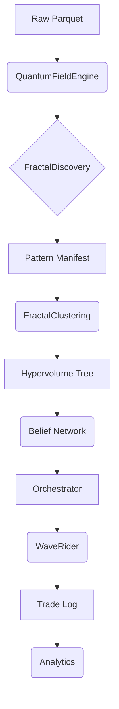

# Bayesian-AI — Architecture Reference
> Auto-generated by Jules on 2026-02-26. Do not edit manually.

## System Overview
Bayesian-AI is a high-performance algorithmic trading system that combines quantum-inspired physics fields with Bayesian probability networks. It ingests high-resolution market data (1s/15s bars), constructs a "Three-Body Quantum State" representing market forces (gravity, momentum, volatility), and uses a hierarchical fractal belief network to predict price movements.

The system operates in a rigorous walk-forward manner:
1. **Discovery:** Scans historical data top-down (1h→1s) to identify recurrent geometric and structural patterns.
2. **Clustering:** Groups these patterns into templates using a Hypervolume Tree (16D feature space).
3. **Belief Network:** 10 independent workers (1h, 30m... 1s) monitor live data, voting on direction and conviction.
4. **Execution:** The Orchestrator manages trades via the WaveRider execution engine, which handles dynamic trailing stops, profit targets, and structural exits (CST).

## Phase Pipeline
| Phase | Name | File | Description |
|-------|------|------|-------------|
| 2 | Pattern Discovery | `training/fractal_discovery_agent.py` | Scans ATLAS for recurring fractal structures. |
| 2.5 | Clustering | `training/fractal_clustering.py` | Groups patterns into Hypervolume Tree templates. |
| 3 | Optimization | `training/orchestrator.py` | Optimizes template parameters (DOE/Optuna). |
| 4 | Forward Pass | `training/orchestrator.py` | Simulates trading using the Belief Network. |
| 5 | Strategy Selection | `training/orchestrator.py` | Ranks templates by risk-adjusted returns. |
| 6 | OOS Validation | `training/orchestrator.py` | Blind validation on holdout data. |

## Core Files
| File | Class / Function | Role |
|------|-----------------|------|
| `core/quantum_field_engine.py` | `QuantumFieldEngine` | Computes 3-body physics (gravity, Z-score, forces) from OHLCV. Vectorized & CUDA-accelerated. |
| `core/bayesian_brain.py` | `QuantumBayesianBrain` | Learns probabilities of success for each state/template. |
| `core/three_body_state.py` | `ThreeBodyQuantumState` | Dataclass holding the full physical state of a bar (Z, V, M, coherence). |
| `core/dynamic_binner.py` | `DynamicBinner` | Maps continuous physics values to discrete bins using Freedman-Diaconis rule. |
| `training/timeframe_belief_network.py` | `TimeframeBeliefNetwork` | Aggregates signals from 8 TF workers into a single "Path Conviction". |
| `training/fractal_clustering.py` | `HypervolumeTree` | Hierarchical clustering structure for pattern matching (16D). |
| `training/wave_rider.py` | `WaveRider` | Manages active positions, dynamic trails, and CST structural exits. |

## Key Constants & Parameters
| Constant | Value | Description |
|----------|-------|-------------|
| `MIN_CONVICTION` | 0.48 | Min belief network conviction to enter a trade. |
| `CONSENSUS_CONFIDENCE` | 0.60 | Min Gate 5 consensus score to proceed. |
| `RISK_THETA` | 0.1 | Risk sensitivity parameter in engine. |
| `MAX_FISSION_CLUSTERS` | 6 | Max split for template refinement. |
| `CST_FALLBACK_SIGMA` | 4.5 | Default sigma threshold for Coherent Structure Tether. |
| `BASE_RESOLUTION_SECONDS` | 15 | Base aggregation unit for aggregation workers. |

## CLI Reference
flags for `training/orchestrator.py`:

| Flag | Default | Description |
|------|---------|-------------|
| `--data` | `DATA/ATLAS` | Path to training data source (folder or file). |
| `--forward-pass` | `False` | Run Phase 4 simulation using existing library. |
| `--fresh` | `False` | Clear all checkpoints and start training from scratch. |
| `--dashboard` | `False` | Launch full visualization dashboard. |
| `--no-dashboard` | `False` | Disable all UI elements (headless). |
| `--min-tier` | `None` | Filter execution to templates of this tier or better (1-4). |
| `--account-size` | `0.0` | Simulate funded account equity (gates trades on margin). |
| `--oos` | `False` | Run Out-Of-Sample validation mode (reports/oos). |

## Data Flow

## Output Files
| File | Location | Description |
|------|----------|-------------|
| `oracle_trade_log.csv` | `reports/{mode}/` | Detailed log of every executed trade. |
| `signal_log.csv` | `reports/{mode}/` | Log of all candidates and gate decisions (including skips). |
| `phase4_report.txt` | `reports/{mode}/` | Human-readable summary of forward pass performance. |
| `trade_analytics.txt` | `reports/{mode}/` | Deep statistical analysis (t-tests, ANOVA) of trades. |
| `hypervolume_tree.pkl` | `checkpoints/` | Serialized pattern recognition tree. |
| `pattern_library.pkl` | `checkpoints/` | Flat dictionary of template logic and stats. |
| `depth_weights.json` | `checkpoints/` | Learned PnL weights per fractal depth. |
