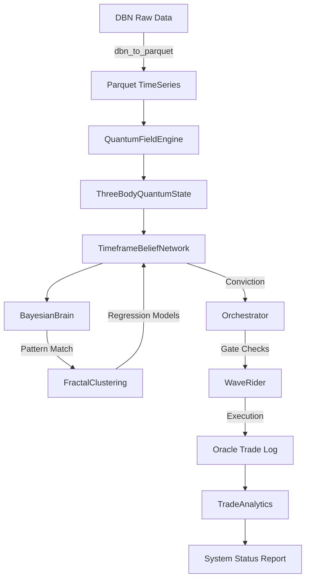

# Bayesian-AI — Architecture Reference
> Auto-generated by Jules on 2026-02-26. Do not edit manually.

## System Overview
Bayesian-AI is a high-frequency trading system that leverages quantum physics-inspired market models (three-body problem, gravity wells, event horizons) to identify structural anomalies in price action. It employs a fractal analysis approach, correlating signals across 8 distinct timeframe levels (15s to 1h) using a "Timeframe Belief Network". The core hypothesis is that price moves are governed by "Nightmare Protocols" (gravity, entropy) and can be predicted by observing the "Quantum State" of the market (Z-score, velocity, momentum, coherence).

The system operates in phases, from data ingestion and pattern discovery to template optimization and forward testing. It uses a "Bayesian Brain" to map market states to historical probabilities and executes trades via a "Wave Rider" logic that dynamically manages risk based on wave maturity and structural integrity (CST).

## Phase Pipeline
| Phase | Name | File | Description |
|-------|------|------|-------------|
| 1 | Data Prep | `dbn_to_parquet.py` | Converts Databento DBN files to optimized Parquet time-series. |
| 2 | Pattern Discovery | `fractal_discovery_agent.py` | Scans historical data to identify recurring fractal patterns (shapes). |
| 3 | Template Optimization | `fractal_clustering.py` | Clusters patterns into high-confidence templates and fits regression models. |
| 4 | Forward Pass | `orchestrator.py` | Simulates trading using the optimized playbook on OOS data. |
| 5 | Strategy Selection | `orchestrator.py` | Filters templates based on performance metrics (Tier 1-3). |

## Core Files
| File | Class / Function | Role |
|------|-----------------|------|
| `core/quantum_field_engine.py` | `QuantumFieldEngine` | Computes physics metrics (gravity, forces, Z-score) using vectorized CPU/GPU kernels. |
| `core/bayesian_brain.py` | `BayesianBrain` | Manages pattern library and retrieves probabilistic beliefs from market states. |
| `core/three_body_state.py` | `ThreeBodyQuantumState` | Dataclass representing the full physics state of a single bar. |
| `core/dynamic_binner.py` | `DynamicBinner` | Maps continuous physics values to discrete bins using Freedman-Diaconis rule. |
| `training/orchestrator.py` | `Orchestrator` | Main entry point; manages the 5-phase pipeline and coordinates components. |
| `training/fractal_clustering.py` | `FractalClustering` | Groups raw patterns into templates; calculates win rates and regression coeffs. |
| `training/fractal_dna_tree.py` | `FractalDNATree` | Manages the hierarchical relationships between patterns across timeframes. |
| `training/timeframe_belief_network.py` | `TimeframeBeliefNetwork` | Aggregates beliefs from 8 worker levels to form a consensus conviction. |
| `training/wave_rider.py` | `WaveRider` | Execution engine; handles entry, dynamic trailing stops, and regret analysis. |
| `training/trade_analytics.py` | `TradeAnalytics` | Post-run statistical analysis (ANOVA, Regression) of trade performance. |
| `visualization/live_training_dashboard.py` | `Dashboard` | Real-time Tkinter UI for monitoring training progress and trade logs. |

## Key Constants & Parameters
| Constant | Value | Description |
|----------|-------|-------------|
| `RISK_THETA` | 0.1 | Risk aversion parameter in quantum field calculations. |
| `VELOCITY_CASCADE_THRESHOLD` | 1.0 | Minimum velocity (pts/sec) to trigger a cascade event. |
| `CST_FALLBACK_SIGMA_THRESHOLD` | 4.5 | Default sigma threshold for structural breaks if basin stats missing. |
| `MIN_CONVICTION` | 0.52 | Minimum belief conviction required to enter a trade (Gate 3). |
| `ADX_PERIOD` | 14 | Lookback period for ADX/DMI trend strength calculation. |
| `HURST_WINDOW` | 100 | Window size for calculating the Hurst exponent (fractal dimension). |

## CLI Reference
| Flag | Default | Description |
|------|---------|-------------|
| `--data` | `DATA/ATLAS` | Path to ATLAS root or input data file. |
| `--iterations` | 1000 | Number of training iterations per pattern. |
| `--checkpoint-dir` | `checkpoints` | Directory to save/load model artifacts. |
| `--no-dashboard` | `False` | Disable all UI elements (headless mode). |
| `--dashboard` | `False` | Show full dashboard instead of lightweight popup. |
| `--forward-pass` | `False` | Run Phase 4 simulation using existing playbook. |
| `--fresh` | `False` | Clear all checkpoints and start training from scratch. |
| `--min-tier` | `None` | Filter templates by minimum quality tier (1-4). |
| `--train-end` | `None` | End date for training data (YYYYMMDD). |
| `--forward-data` | `None` | Path to specific OOS data for forward pass. |

## Data Flow

## Output Files
| File | Location | Description |
|------|----------|-------------|
| `oracle_trade_log_*.csv` | `run_logs/` | Detailed log of every trade with physics metrics and outcome. |
| `phase4_report.txt` | `checkpoints/` | Summary report of the forward pass simulation. |
| `trade_analytics.txt` | `run_logs/` | Statistical analysis of trade performance (ANOVA, Regression). |
| `pattern_library_long.pkl` | `checkpoints/` | Serialized library of LONG pattern templates. |
| `pattern_library_short.pkl` | `checkpoints/` | Serialized library of SHORT pattern templates. |
| `depth_weights.json` | `checkpoints/` | Learned weights for each fractal depth level. |
