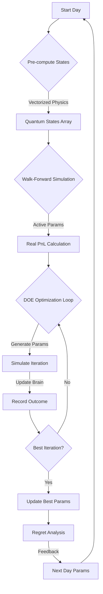

# System Logic, Mathematics, and Parameter Reference

This document serves as the primary technical reference for the **Bayesian-AI Trading System**. It details the core logic, the mathematical models ("Nightmare Protocol"), the learning cycle, and the parameters optimized during training. It is intended for developers and engineers troubleshooting the system's decision-making process.

---

## 1. System Architecture Overview

The system operates as a **Quantum-Bayesian Hybrid**, combining physics-based state estimation with probabilistic learning.

### Core Components

1.  **`TrainingOrchestrator` (`training/orchestrator.py`)**: The central nervous system. It manages the data pipeline, simulation loops, and optimization strategies.
2.  **`QuantumFieldEngine` (`core/quantum_field_engine.py`)**: The physics engine. It computes the "Three-Body Quantum State" for every market tick, applying gravitational and quantum mechanical models to price action.
3.  **`DOEParameterGenerator` (`training/doe_parameter_generator.py`)**: The strategist. It generates experimental parameter sets using Design of Experiments (DOE) techniques (LHS, Mutation, Response Surface) to optimize performance.
4.  **`QuantumBayesianBrain` (`core/bayesian_brain.py`)**: The memory. It maps discrete quantum states to historical win/loss probabilities.
5.  **`WaveRider` (`training/wave_rider.py`)**: The executioner. It manages active positions, trailing stops, and exit logic during simulation.

---

## 2. The Learning Cycle (Process Flow)

The system learns by replaying historical data, simulating trades, and refining its internal probability map (`BayesianBrain`) and external control parameters (`ParameterSet`).

### Logic Flow Diagram

### Step-by-Step Explanation

1.  **Data Ingestion**: Raw 1-second OHLCV data is loaded and resampled to the target timeframe (default: 15s).
2.  **Vectorized Pre-computation**: The `QuantumFieldEngine` processes the entire day's data in one pass (using `numpy` or `torch`), computing the `ThreeBodyQuantumState` for every bar. This includes:
    *   **Gravity Wells**: Attractors based on linear regression centers.
    *   **Singularities**: "Roche Limits" defined by volatility (Sigma).
    *   **Wave Function**: Probability amplitudes for price position.
3.  **Walk-Forward Simulation**: The system trades the current day using the *best parameters found yesterday*. This generates the **"Real PnL"** metric, which represents actual performance on unseen data.
4.  **Oracle Optimization (DOE)**: The system then "peeks" at the current day to find the optimal parameters *for that specific day*. This updates the `BayesianBrain` with high-quality trade data and sets the baseline for the *next* day's Walk-Forward step.
    *   **Strategies**: Baseline (fixed), Latin Hypercube (space-filling), Mutation (evolutionary), Response Surface (quadratic optimization).
5.  **Regret Analysis**: At the end of the day, the system analyzes "money left on the table" (e.g., exiting too early). This feedback biases the Mutation strategy for the next day (e.g., "try holding longer").

---

## 3. Mathematical Model ("The Nightmare Protocol")

The core physics engine applies concepts from celestial mechanics and quantum mechanics to financial time series.

### A. Three-Body Gravity
The market is modeled as a particle (Price) moving in a potential field generated by three "bodies":
1.  **Center Mass (Mean)**: The linear regression line of the macro trend (default: 21 bars).
2.  **Upper Singularity (Resistance)**: $Center + 2\sigma$.
3.  **Lower Singularity (Support)**: $Center - 2\sigma$.

**Force Equation**:
$$ F_{gravity} = -\theta \cdot (Price - Center) $$
*   $\theta$ (`gravity_theta`): The mean reversion speed (Ornstein-Uhlenbeck parameter).

### B. Fractal Diffusion
Volatility ($\sigma$) is not constant. It scales based on the **Hurst Exponent ($H$)**, which measures the time series' "roughness" or trend persistence.

**Nightmare Sigma Formula**:
$$ \sigma_{fractal} = \sigma_{base} \cdot \left( \frac{v_{micro}}{v_{macro}} \right)^H $$
*   $v_{micro}$: Tick-by-tick velocity.
*   $v_{macro}$: Rolling average volatility.
*   $H$: Hurst exponent ($0.5 = Random, >0.5 = Trending, <0.5 = Mean Reverting$).

### C. PID Control (Algorithmic Counter-Force)
To model algorithmic trading reaction, a PID controller applies a force opposing the price error (deviation from mean).

**PID Force**:
$$ F_{pid} = -(K_p \cdot e + K_i \cdot \int e dt + K_d \cdot \frac{de}{dt}) $$
*   $e$: Error ($Price - Center$).
*   $K_p, K_i, K_d$: Optimized parameters.

### D. Quantum Wave Function
The probability of the price being at a location is modeled by a superposition of states.

**Wave Equation**:
$$ \Psi(x) = a_0 \cdot \psi_{center} + a_1 \cdot \psi_{upper} + a_2 \cdot \psi_{lower} $$
*   The square of the amplitude $|\Psi(x)|^2$ gives the probability density.
*   **Tunneling**: The probability of price "tunneling" through a barrier (Roche Limit) is calculated using the WKB approximation:
    $$ P_{tunnel} \approx \exp\left(-2 \int \sqrt{2m(V(x)-E)} dx\right) $$

---

## 4. Optimized Parameter Reference

These parameters are dynamically tuned by `DOEParameterGenerator` to maximize PnL and Sharpe Ratio.

### Core Strategy Parameters

| Parameter | Range | Type | Description |
| :--- | :--- | :--- | :--- |
| `stop_loss_ticks` | 10 - 25 | Int | Initial stop loss distance (in ticks). 1 tick = 0.25 pts (MNQ). |
| `take_profit_ticks` | 30 - 60 | Int | Fixed take profit target (in ticks). |
| `confidence_threshold` | 0.30 - 0.70 | Float | Minimum Bayesian confidence required to enter a trade. |
| `max_hold_seconds` | 300 - 900 | Int | Time limit before forcing a trade exit. |
| `trading_cost_points` | 0.25 - 1.0 | Float | Simulated slippage + commission per round trip. |
| `timeframe_idx` | 0 - 5 | Int | Aggregation interval: 0=5s, 1=15s, 2=60s, 3=5m, 4=15m, 5=1h. |

### Trailing Stop Logic

| Parameter | Range | Type | Description |
| :--- | :--- | :--- | :--- |
| `trail_activation_profit` | 30 - 100 | Int | Profit (ticks) required to activate trailing stop. |
| `trail_distance_tight` | 5 - 15 | Int | Trailing distance (ticks) when profit is low. |
| `trail_distance_wide` | 20 - 40 | Int | Trailing distance (ticks) when profit is high. |

### Physics & Control (Nightmare Equation)

| Parameter | Range | Type | Description |
| :--- | :--- | :--- | :--- |
| `gravity_theta` | 0.1 - 0.8 | Float | Strength of mean reversion pull ($F_{gravity}$). |
| `pid_kp` | 0.1 - 1.0 | Float | Proportional gain (Reaction to immediate error). |
| `pid_ki` | 0.01 - 0.2 | Float | Integral gain (Reaction to accumulated error). |
| `pid_kd` | 0.1 - 0.5 | Float | Derivative gain (Dampening of error rate). |
| `sigma_decay` | 0.8 - 0.99 | Float | Decay rate for volatility memory. |

### Signal Confirmation Filters

| Parameter | Range | Type | Description |
| :--- | :--- | :--- | :--- |
| `cascade_min_points` | 5 - 20 | Int | Minimum price move to trigger L9 Cascade detection. |
| `min_entry_velocity` | 2 - 10 | Int | Minimum tick velocity required for entry. |
| `volume_spike_threshold` | 1.5 - 3.0 | Float | Volume multiple above mean required for confirmation. |
| `killzone_tolerance_ticks`| 3 - 10 | Int | Allowed deviation from key support/resistance zones. |

---

## 5. Troubleshooting Logic & Math

### Interpreting the Dashboard vs. Terminal
*   **Terminal Output**: Shows **"Walk-Forward / Real"** results. This is the performance using parameters optimized on *past* data applied to *current* (unseen) data. This is the true test of the system's predictive power.
*   **Live Dashboard**: Shows **"Oracle / Optimized"** results. This is the best possible PnL found for the *current* day after optimization. It represents the "potential" of the strategy if it had perfect foresight.

### Convergence Issues
If `Real PnL` is consistently negative while `Optimized PnL` is positive:
1.  **Overfitting**: The DOE is finding parameters that work only for specific noise patterns. Increase `min_samples_required` or reduce parameter ranges.
2.  **Regime Change**: The market dynamics (volatility, trend) are shifting faster than the learning rate. Check `sigma_decay` and `gravity_theta`.

### CUDA vs. CPU Execution
*   The system auto-detects CUDA.
*   **Physics Engine**: Vectorized on CPU (numpy) or GPU (torch).
*   **DOE Optimization**:
    *   **CPU**: Sequential processing of parameter sets.
    *   **GPU**: Parallel simulation of all parameter sets simultaneously.
*   If `scripts/fix_cuda.py` is needed, run it to force a reinstall of PyTorch with CUDA support.

### Common Errors
*   **"Insufficient Data"**: The `QuantumFieldEngine` requires a warmup period (default 21 bars) to compute regression slopes. Ensure data feeds have enough history.
*   **"Singular Matrix"**: Occurs in Response Surface Optimization (Ridge Regression) if parameter sets are too similar. The system automatically falls back to Mutation strategy.
