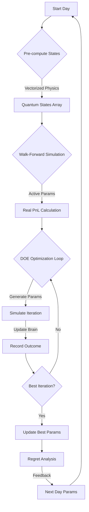

# Bayesian-AI Technical Manual

This document is the **single source of truth** for the Bayesian-AI trading system. It consolidates system logic, parameters, dashboard usage, and legacy architecture references.

---

## 📚 Table of Contents

1.  [**Part 1: System Logic & Parameters (Current Architecture)**](#part-1-system-logic--parameters-current-architecture)
    *   [System Architecture Overview](#1-system-architecture-overview)
    *   [The Learning Cycle (Process Flow)](#2-the-learning-cycle-process-flow)
    *   [Mathematical Model ("The Nightmare Protocol")](#3-mathematical-model-the-nightmare-protocol)
    *   [Optimized Parameter Reference](#4-optimized-parameter-reference)
    *   [Troubleshooting Logic & Math](#5-troubleshooting-logic--math)
2.  [**Part 2: Dashboard Guide**](#part-2-dashboard-guide)
    *   [Quick Start](#quick-start)
    *   [Workflow Sections](#workflow-sections)
3.  [**Part 3: Legacy Reference (Archived)**](#part-3-legacy-reference-archived)
    *   [Original 9-Layer Architecture](#original-9-layer-architecture)
    *   [Module Reference](#module-reference)
4.  [**Part 4: Current Project Status**](#part-4-current-project-status)
    *   [Architecture Status](#architecture-status)
    *   [File Structure](#file-structure)
    *   [Testing Status](#testing-status)

---

# Part 1: System Logic & Parameters (Current Architecture)

This section details the active **Quantum-Bayesian Hybrid** system, including the "Nightmare Protocol" physics engine and Design of Experiments (DOE) optimization.

## 1. System Architecture Overview

The system combines physics-based state estimation with probabilistic learning.

### Core Components

1.  **`TrainingOrchestrator` (`training/orchestrator.py`)**: The central nervous system. It manages the data pipeline, simulation loops, and optimization strategies.
2.  **`QuantumFieldEngine` (`core/quantum_field_engine.py`)**: The physics engine. It computes the "Three-Body Quantum State" for every market tick, applying gravitational and quantum mechanical models to price action.
3.  **`DOEParameterGenerator` (`training/doe_parameter_generator.py`)**: The strategist. It generates experimental parameter sets using Design of Experiments (DOE) techniques (LHS, Mutation, Response Surface) to optimize performance.
4.  **`QuantumBayesianBrain` (`core/bayesian_brain.py`)**: The memory. It maps discrete quantum states to historical win/loss probabilities.
5.  **`WaveRider` (`training/wave_rider.py`)**: The executioner. It manages active positions, trailing stops, and exit logic during simulation.

## 2. The Learning Cycle (Process Flow)

The system learns by replaying historical data, simulating trades, and refining its internal probability map (`BayesianBrain`) and external control parameters (`ParameterSet`).

### Logic Flow Diagram



### Step-by-Step Explanation

1.  **Data Ingestion**: Raw 1-second OHLCV data is loaded and resampled to the target timeframe (default: 15s).
2.  **Vectorized Pre-computation**: The `QuantumFieldEngine` processes the entire day's data in one pass (using `numpy` or `torch`), computing the `ThreeBodyQuantumState` for every bar. This includes:
    *   **Gravity Wells**: Attractors based on linear regression centers.
    *   **Singularities**: "Roche Limits" defined by volatility (Sigma).
    *   **Wave Function**: Probability amplitudes for price position.
3.  **Walk-Forward Simulation**: The system trades the current day using the *best parameters found yesterday*. This generates the **"Real PnL"** metric, which represents actual performance on unseen data.
4.  **Oracle Optimization (DOE)**: The system then "peeks" at the current day to find the optimal parameters *for that specific day*. This updates the `BayesianBrain` with high-quality trade data and sets the baseline for the *next* day's Walk-Forward step.
    *   **Strategies**: Baseline (fixed), Latin Hypercube (space-filling), Mutation (evolutionary), Response Surface (quadratic optimization).
5.  **Regret Analysis**: At the end of the day, the system analyzes "money left on the table" (e.g., exiting too early). This feedback biases the Mutation strategy for the next day (e.g., "try holding longer").

## 3. Mathematical Model ("The Nightmare Protocol")

The core physics engine applies concepts from celestial mechanics and quantum mechanics to financial time series.

### A. Three-Body Gravity
The market is modeled as a particle (Price) moving in a potential field generated by three "bodies":
1.  **Center Mass (Mean)**: The linear regression line of the macro trend (default: 21 bars).
2.  **Upper Singularity (Resistance)**: $Center + 2\sigma$.
3.  **Lower Singularity (Support)**: $Center - 2\sigma$.

**Force Equation**:
$$ F_{gravity} = -\theta \cdot (Price - Center) $$
*   $\theta$ (`gravity_theta`): The mean reversion speed (Ornstein-Uhlenbeck parameter).

### B. Fractal Diffusion
Volatility ($\sigma$) is not constant. It scales based on the **Hurst Exponent ($H$)**, which measures the time series' "roughness" or trend persistence.

**Nightmare Sigma Formula**:
$$ \sigma_{fractal} = \sigma_{base} \cdot \left( \frac{v_{micro}}{v_{macro}} \right)^H $$
*   $v_{micro}$: Tick-by-tick velocity.
*   $v_{macro}$: Rolling average volatility.
*   $H$: Hurst exponent ($0.5 = Random, >0.5 = Trending, <0.5 = Mean Reverting$).

### C. PID Control (Algorithmic Counter-Force)
To model algorithmic trading reaction, a PID controller applies a force opposing the price error (deviation from mean).

**PID Force**:
$$ F_{pid} = -(K_p \cdot e + K_i \cdot \int e dt + K_d \cdot \frac{de}{dt}) $$
*   $e$: Error ($Price - Center$).
*   $K_p, K_i, K_d$: Optimized parameters.

### D. Quantum Wave Function
The probability of the price being at a location is modeled by a superposition of states.

**Wave Equation**:
$$ \Psi(x) = a_0 \cdot \psi_{center} + a_1 \cdot \psi_{upper} + a_2 \cdot \psi_{lower} $$
*   The square of the amplitude $|\Psi(x)|^2$ gives the probability density.
*   **Tunneling**: The probability of price "tunneling" through a barrier (Roche Limit) is calculated using the WKB approximation:
    $$ P_{tunnel} \approx \exp\left(-2 \int \sqrt{2m(V(x)-E)} dx\right) $$

## 4. Optimized Parameter Reference

These parameters are dynamically tuned by `DOEParameterGenerator` to maximize PnL and Sharpe Ratio.

### Core Strategy Parameters

| Parameter | Range | Type | Description |
| :--- | :--- | :--- | :--- |
| `stop_loss_ticks` | 10 - 25 | Int | Initial stop loss distance (in ticks). 1 tick = 0.25 pts (MNQ). |
| `take_profit_ticks` | 30 - 60 | Int | Fixed take profit target (in ticks). |
| `confidence_threshold` | 0.30 - 0.70 | Float | Minimum Bayesian confidence required to enter a trade. |
| `max_hold_seconds` | 300 - 900 | Int | Time limit before forcing a trade exit. |
| `trading_cost_points` | 0.25 - 1.0 | Float | Simulated slippage + commission per round trip. |
| `timeframe_idx` | 0 - 5 | Int | Aggregation interval: 0=5s, 1=15s, 2=60s, 3=5m, 4=15m, 5=1h. |

### Trailing Stop Logic

| Parameter | Range | Type | Description |
| :--- | :--- | :--- | :--- |
| `trail_activation_profit` | 30 - 100 | Int | Profit (ticks) required to activate trailing stop. |
| `trail_distance_tight` | 5 - 15 | Int | Trailing distance (ticks) when profit is low. |
| `trail_distance_wide` | 20 - 40 | Int | Trailing distance (ticks) when profit is high. |

### Physics & Control (Nightmare Equation)

| Parameter | Range | Type | Description |
| :--- | :--- | :--- | :--- |
| `gravity_theta` | 0.1 - 0.8 | Float | Strength of mean reversion pull ($F_{gravity}$). |
| `pid_kp` | 0.1 - 1.0 | Float | Proportional gain (Reaction to immediate error). |
| `pid_ki` | 0.01 - 0.2 | Float | Integral gain (Reaction to accumulated error). |
| `pid_kd` | 0.1 - 0.5 | Float | Derivative gain (Dampening of error rate). |
| `sigma_decay` | 0.8 - 0.99 | Float | Decay rate for volatility memory. |

### Signal Confirmation Filters

| Parameter | Range | Type | Description |
| :--- | :--- | :--- | :--- |
| `cascade_min_points` | 5 - 20 | Int | Minimum price move to trigger L9 Cascade detection. |
| `min_entry_velocity` | 2 - 10 | Int | Minimum tick velocity required for entry. |
| `volume_spike_threshold` | 1.5 - 3.0 | Float | Volume multiple above mean required for confirmation. |
| `killzone_tolerance_ticks`| 3 - 10 | Int | Allowed deviation from key support/resistance zones. |

## 5. Troubleshooting Logic & Math

### Interpreting the Dashboard vs. Terminal
*   **Terminal Output**: Shows **"Walk-Forward / Real"** results. This is the performance using parameters optimized on *past* data applied to *current* (unseen) data. This is the true test of the system's predictive power.
*   **Live Dashboard**: Shows **"Oracle / Optimized"** results. This is the best possible PnL found for the *current* day after optimization. It represents the "potential" of the strategy if it had perfect foresight.

### Convergence Issues
If `Real PnL` is consistently negative while `Optimized PnL` is positive:
1.  **Overfitting**: The DOE is finding parameters that work only for specific noise patterns. Increase `min_samples_required` or reduce parameter ranges.
2.  **Regime Change**: The market dynamics (volatility, trend) are shifting faster than the learning rate. Check `sigma_decay` and `gravity_theta`.

### CUDA vs. CPU Execution
*   The system auto-detects CUDA.
*   **Physics Engine**: Vectorized on CPU (numpy) or GPU (torch).
*   **DOE Optimization**:
    *   **CPU**: Sequential processing of parameter sets.
    *   **GPU**: Parallel simulation of all parameter sets simultaneously.
*   If `scripts/fix_cuda.py` is needed, run it to force a reinstall of PyTorch with CUDA support.

### Common Errors
*   **"Insufficient Data"**: The `QuantumFieldEngine` requires a warmup period (default 21 bars) to compute regression slopes. Ensure data feeds have enough history.
*   **"Singular Matrix"**: Occurs in Response Surface Optimization (Ridge Regression) if parameter sets are too similar. The system automatically falls back to Mutation strategy.

---

# Part 2: Dashboard Guide

The **Bayesian-AI Dashboard** (`notebooks/dashboard.ipynb`) is the primary consolidated interface for verifying the system environment, performing rapid learning simulations, and executing full training cycles.

## Quick Start

1. **Install Requirements**
   ```bash
   pip install -r requirements.txt
   ```
   *Note: Ensure `jupyter` and `ipywidgets` are installed.*

2. **Generate/Reset Notebook**
   If the notebook is missing or you want to reset it to the latest version:
   ```bash
   python scripts/generate_dashboard.py
   ```

3. **Launch Notebook**
   ```bash
   jupyter notebook notebooks/dashboard.ipynb
   ```

## Workflow Sections

### 1. Preflight & Environment Checks ✈️
Verifies the operational readiness of the system.
*   **Operational Mode**: Must be set to `LEARNING` in `config/settings.py`.
*   **Environment**: Checks Python version and path resolution.
*   **CUDA Audit**: Runs the 3-stage hardened verification (Handshake -> Injection -> Handoff) to ensure the GPU is ready for heavy lifting. Logs details to `CUDA_Debug.log`.

### 2. Data Pipeline Test 📊
*   Validates loading of a single data file from `DATA/RAW`.
*   Ensures that data can be read and processed correctly before attempting larger operations.

### 3. Core Component Tests ⚙️
*   Verifies initialization of critical modules: `StateVector`, `BayesianBrain`, and `LayerEngine`.
*   Checks if CUDA acceleration is active for the Layer Engine.

### 4. Quick Learn: 3 Discrete Day Simulation 🎲
This is the "Quick Learning" phase.
*   **Action**: Randomly selects 3 distinct files/days from the available dataset.
*   **Process**: Runs a "simulation" (1 training iteration) for each file individually using the `TrainingOrchestrator`.
*   **Goal**: Rapidly verify that the logic holds up across different market conditions without waiting for a full historical run.
*   **Output**: Displays Win Rate and PnL for each of the 3 sampled files.

### 5. Mini Training Run (5 Iterations) 🏃‍♂️
*   Runs a short, interactive 5-iteration training session on the sample data loaded in Section 2.
*   Useful for a quick end-to-end test of the training loop logic.

### 6. Full Learning Cycle (Production Run) 🚀
Once confident in the Quick Learn and Mini Run results:
*   **Action**: Triggers the `TrainingOrchestrator` on the **entire** dataset.
*   **Parameters**: Default 50 iterations (can be adjusted in the cell code).
*   **Output**: Saves the final trained model to `models/production_learning/probability_table.pkl` and visualizes PnL/Confidence in real-time.

### 7. Result Analysis & Visualization 📈
*   Inspects the learned probability tables.
*   Compares the "Quick Learn", "Mini Run", and "Production Model" results.
*   Integrates with the Visualization Module to plot training results.

## ⚠️ Notes

- **Operational Mode**: The system enforces `LEARNING` mode to prevent accidental live execution commands during training.
- **Resource Usage**: The "Quick Learn" step loads data into memory. Ensure you have sufficient RAM.
- **CUDA**: The Full Learning Cycle enforces GPU usage by default. Ensure your environment is CUDA-ready.

---

# Part 3: Legacy Reference (Archived)

> **⚠️ NOTE: DEPRECATED ARCHITECTURE**
>
> This section describes the original **9-Layer Hierarchy**. While concepts like the Data Pipeline and Bayesian Brain remain, the specific Layer 1-9 logic has been superseded by the Quantum Field Engine described in Part 1.

## Original 9-Layer Architecture

The system's "vision" was defined by a 9-layer state vector.

| Layer | Timeframe | Description | Computation Type | Logic / Thresholds |
|-------|-----------|-------------|------------------|-------------------|
| **L1** | 90-Day | **Bias** (Bull/Bear/Range) | Static (CPU) | **Bull:** > +5% change.<br>**Bear:** < -5% change.<br>**Range:** Within ±5%. |
| **L2** | 30-Day | **Regime** (Trending/Chopping) | Static (CPU) | **Trending:** Recent 5-day range > 1.5x of 30-day avg range.<br>**Chopping:** Otherwise. |
| **L3** | 1-Week | **Swing** (Structure) | Static (CPU) | Checks last 4 weeks for Higher Highs/Lower Lows.<br>Else Sideways. |
| **L4** | Daily | **Zone** (Support/Resistance) | Static (CPU) | **Support:** Closer to 5-day Low.<br>**Resistance:** Closer to 5-day High.<br>**Killzone:** Within tolerance of user zones.<br>**Mid:** In between. |
| **L5** | 4-Hour | **Trend** (Direction) | Fluid (CPU) | **Up:** Last 3 closes ascending.<br>**Down:** Last 3 closes descending.<br>**Flat:** Mixed. |
| **L6** | 1-Hour | **Structure** (Candle mix) | Fluid (CPU) | **Bullish:** Bull candles > 1.5x Bear candles.<br>**Bearish:** Bear candles > 1.5x Bull candles.<br>**Neutral:** Balanced. |
| **L7** | 15-Min | **Pattern** (Recognition) | Fluid (**CUDA**) | **Compression:** Recent range < 70% of prev range.<br>**Wedge:** Converging highs/lows.<br>**Breakdown:** New low below prior support.<br>*Priority: Compression > Wedge > Breakdown.* |
| **L8** | 5-Min | **Confirmation** (Volume) | Fluid (**CUDA**) | **Confirmed:** Current volume > 1.2x mean of last 3 volumes.<br>**Unconfirmed:** Otherwise. |
| **L9** | 1-Sec | **Velocity** (Cascade) | Fluid (**CUDA**) | **Cascade:** ≥ 10 points movement in ≤ 0.5 seconds.<br>(Uses sliding window of last 50 ticks). |

## Module Reference

### Core Modules (`core/`)

**`core/engine_core.py` (BayesianEngine)**
*   **Purpose:** Central coordinator that ties together Data, Logic, Learning, and Execution.
*   **Key Methods:**
    *   `initialize_session(historical_data, user_kill_zones)`: Pre-computes Static Context (L1-L4).
    *   `on_tick(tick_data)`: Main event loop. Aggregates data, computes state, manages positions, and checks entry conditions.
    *   `_close_position(price, info)`: Finalizes trades, updates PnL, and sends outcomes to the Brain.
*   **Key Variables:** `daily_pnl`, `MAX_DAILY_LOSS` (-200), `MIN_PROB` (0.80), `MIN_CONF` (0.30).

**`layer_engine.py` (LayerEngine)**
*   **Purpose:** Computes the 9-layer `StateVector` from market data. Separates Static (session-start) from Fluid (real-time) layers.
*   **Key Methods:**
    *   `initialize_static_context(...)`: Computes L1-L4 (Bias, Regime, Swing, Zone) once.
    *   `compute_current_state(current_data)`: Computes L5-L9 (Trend, Structure, Pattern, Confirm, Cascade) every tick.
    *   `_compute_L7_15m(...)`: Delegates to `pattern_detector`.
    *   `_compute_L9_1s(...)`: Delegates to `velocity_gate`.

### CUDA Modules (`cuda_modules/`)

**`pattern_detector.py` (CUDAPatternDetector)**
*   **Purpose:** L7 Pattern Recognition on 15m bars.
*   **Methods:** `detect(bars)`, `_detect_gpu`, `_detect_cpu`.
*   **Logic:** Prioritizes **Compression** (Range < 70% prev) > **Wedge** > **Breakdown**.
*   **Optimization:** Transfers only last 200 bars (`LOOKBACK`) to GPU.

**`confirmation.py` (CUDAConfirmationEngine)**
*   **Purpose:** L8 Volume Confirmation on 5m bars.
*   **Methods:** `confirm(bars)`, `confirm_kernel` (Numba).
*   **Logic:** Checks if current volume > 1.2x mean of last 3 volumes.

**`velocity_gate.py` (CUDAVelocityGate)**
*   **Purpose:** L9 Cascade Detection on ticks.
*   **Methods:** `detect_cascade(tick_data)`.
*   **Logic:** Checks if price moves ≥ 10 points in ≤ 0.5s within the last 50 ticks.
*   **Optimization:** Processes only relevant tail of tick data.

---

# Part 4: Current Project Status

> **Snapshot Timestamp:** 2026-02-11

## Architecture Status
- **Current State:** QUANTUM (Fractal Three-Body)
- **Active Engine:** Fractal Three-Body Quantum (PyTorch)
- **Archived Engine:** Legacy 9-Layer Hierarchy (Moved to `archive/`)
- **Details:** See `AUDIT_REPORT_2026_02_12.md`

## File Structure
*Key directories and files relevant to current development.*

```
Bayesian-AI/
│   ├── AGENTS.md
│   ├── README.md
│   ├── launch_full_training.sh
│   ├── requirements.txt
│   ├── AUDIT/                  # Audit reports
│   ├── DATA/                   # Data storage
│   ├── archive/                # Deprecated code
│   ├── config/                 # Configuration
│   ├── core/                   # Core Logic Engines (Quantum Field, Brain)
│   ├── cuda_modules/           # GPU-Accelerated Components (Legacy/Mixed)
│   ├── docs/                   # Documentation (Technical Manual)
│   ├── execution/              # Trade Execution Logic
│   ├── notebooks/              # Jupyter Notebooks (Dashboard)
│   ├── scripts/                # Utility & Build Scripts
│   ├── tests/                  # Test Suite
│   ├── training/               # Historical Learning Pipeline
│   └── visualization/          # Dashboard Code
```

## Testing Status
*   **Logic Core Validation:** PASS (`pytest tests/topic_math.py`)
*   **Manifest Integrity:** PASS (All required files present)
*   **Training Validation:** SUCCESS (End-to-end training loop functional)
