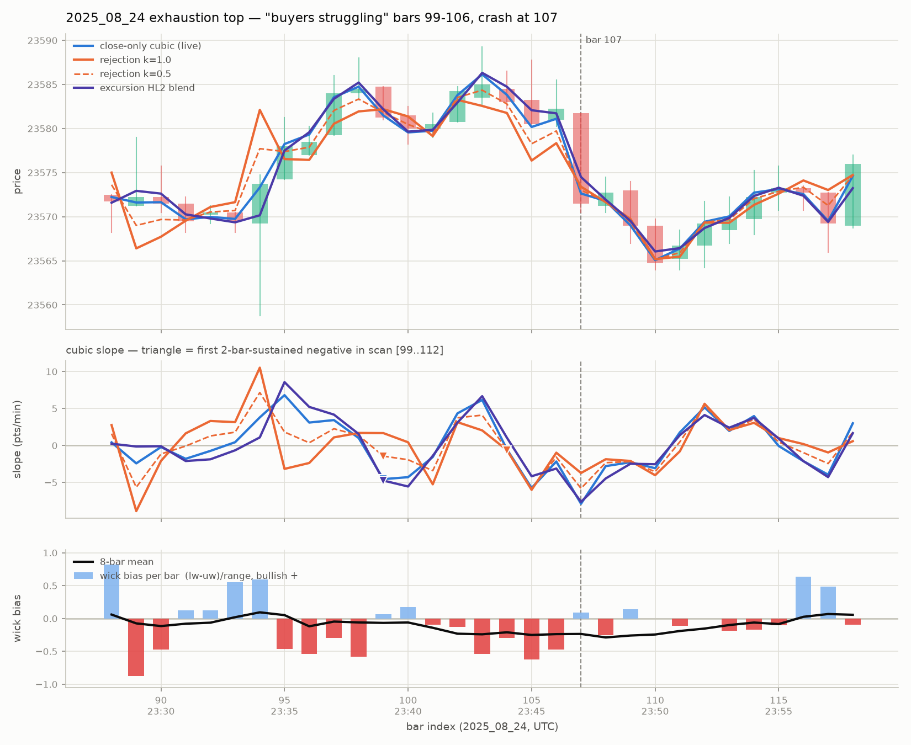
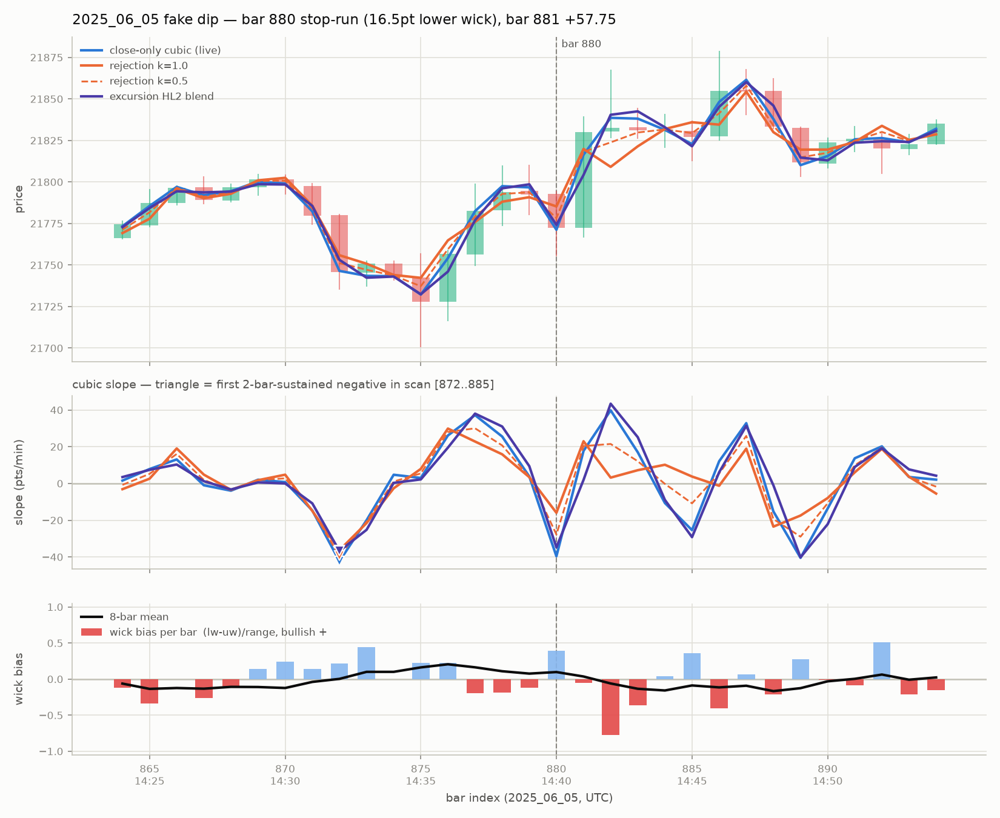

# Wick-sensitive cubic — comparison findings (2026-07-30)

**Question (owner proposal):** make the pocket-dojo cubic "sensitive to wick and body
— this will have the hidden proportion of internal structure." The live cubic
(`research/dojo_forge/tools/cubic_regression.py`, 8-bar/1m window via
`pocket_dojo.CUBIC_W=8`) fits closes only.

**Answer in one line:** do **not** change what the cubic fits — direction (a) buys
nothing measurable at either tell bar and adds noise; direction (b), a separate 8-bar
wick-bias readout alongside the untouched price cubic, mechanically reproduced the
owner's tell at both test bars and is 2.3x more sign-stable than the price-slope
itself. Adopt (b) as a companion signal, exactly the way volume-divergence was read
alongside momentum on 2025_08_24.

Everything below is from `tools/compare_on_tell_bars.py` (rules pre-registered in the
script header before results were seen; full numbers in `comparison_results.json`).
Nothing in the live tools was modified.

## What was built

- `tools/wick_series.py` — derived input series fed to the *unchanged* cubic
  machinery (imported from `cubic_regression.py`, not forked):
  - (a) **rejection school** `p_rej = close + k*(lower_wick - upper_wick)`, k in
    {0.5, 1.0} — a wick is where price got *rejected* (long upper wick = sellers
    capped = push input down). Sign-aligned with the owner's stated reads.
  - (a) **excursion school** `p_exc = 0.5*close + 0.5*(H+L)/2` — a wick is where
    price *traded*. Note this is the naive "blend in HL2" choice and its sign is
    **opposite** the owner's read (growing upper wicks push it *up*).
  - (b) **wick_bias** `(lw-uw)/range` in [-1,+1], bullish positive, read as an
    8-bar trailing mean next to the untouched price cubic; plus `body_frac`
    `|c-o|/range`.
- `tools/compare_on_tell_bars.py` — runs both tell-bar presets + a 6-day whipsaw
  scan, writes `comparison_results.json` + the two PNGs under `assets/`.

Test bars (row indices of `DATA/ATLAS/1m/<day>.parquet`, identical to
`pocket_dojo._bars()` indexing; provenance guards assert bar94 vol=1190, bar107
vol=715, bar879 high=21810, bar880 low=21755.75 so a data refresh cannot silently
shift indexing):

- **2025_08_24 bar 107** — "buyers struggling" exhaustion top (OWNER_PROCESS.md:
  rally 94-98, struggle 99-106 with growing upper wicks + thinning volume, crash 107).
- **2025_06_05 bar 880** — fake dip / stop-run (16.5pt lower wick, closed 21772.25
  after running the 21770.75 stop; next bar +57.75).

Pre-registered rules: DOWN-flag = first bar with 2 consecutive negative slopes in the
scan window (confirmed causally 1 bar later); stability = slope sign flips per 100
warm bars over whole days. An earlier flag from a flippier line is not an improvement,
so both are always reported together.

## Result 1 — direction (a) does NOT flag the top earlier

Slope sign per bar (o=up, X=down), 2025_08_24 bars 97-112, crash at **107**:

| variant | 97 98 | 99 100 101 | 102 103 | 104 105 106 107..110 | 111 112 | rule flag | lead |
|---|---|---|---|---|---|---|---|
| close (live) | o o | X X X | o o | X X X X X X X | o o | **99** | — |
| rejection k=0.5 | o o | X X X | o o | X X X X X X X | o o | 99 | 0 |
| rejection k=1.0 | o o | o o X | o o | X X X X X X X | X o | 104 | **-5 (later)** |
| excursion HL2 | o o | X X X | o o | o X X X X X X | o o | 99 (real turn 105) | 0 |

- The close-only cubic **already flags at bar 99** — the first bar of the owner's
  struggle window. There was no room to be earlier, and no variant was.
- k=0.5 produced a sign sequence **identical to close** on both test days. Its input
  shift (~1pt mean) is sub-threshold: cosmetic, not a signal change.
- k=1.0 flags **5 bars later** (104). Its read of 99-101 ("dip being bought", lower
  wicks) was locally right — price did push to the episode top tick 23589.25 at
  bar 103 — and its single flag at 104 sat adjacent to that top. But it still
  whipsawed as often in-window (4 flips, same as close), and it is the *noisiest*
  line day-wide (below). "Later but cleaner" is not supported; it is later and
  equally flippy.
- Excursion HL2 is **anti-aligned at the tell**, exactly as its sign predicts: still
  positive at bar 104 (+1.05 pts/min) after the top, one bar later than everyone to
  the real turn. On the dip day it was also slowest to recover after the 881 rip
  (slope +1.9 at 881 vs +17.7 close). Its one virtue is smoothness (low-pass), which
  is the wrong currency here. **Kill it.**
- Not one variant beat the close-cubic on the crash bar itself; all were already
  negative 104-110.

## Result 2 — the fake dip: (a) only dampens the dent; (b) names it, at the bar

2025_06_05, slope at the tell (pts/min):

| variant | @879 | @880 (fake-dip dent) | dent vs close | first positive after |
|---|---|---|---|---|
| close (live) | +3.8 | **-39.6** | — | 881 |
| rejection k=0.5 | +3.6 | -27.8 | 30% shallower | 881 |
| rejection k=1.0 | +3.4 | -15.9 | **60% shallower** | 881 |
| excursion HL2 | +9.4 | -34.7 | 12% shallower | 881 |

- Every variant recovers on the same bar (881: +57.75 overwhelms any 8-bar window),
  so (a)'s entire benefit is a *shallower one-bar false dent*. Real, but it never
  changes a decision under any sign- or sustain-based read.
- What actually said "this dip is fake" at the bar: **wick_bias(880) = +0.39** — a
  loud bullish rejection print on a bar whose close fell 20.25pts — while the 8-bar
  bias mean *stayed positive* (+0.10) through the whole flush-recover sequence
  (872-881), including the even bigger bar-875 stop-run. The close-cubic at that
  moment read -39.6 (screaming down). The wick companion is the only series in this
  study that carried the owner's read in real time.
- Unprompted repeat, same day: bars 884-885 dipped with 10-14pt lower wicks (bought
  dips); rejection k=1.0 held positive slope through them while close/HL2 went
  -20..-29, and price pushed to a new high at 886. Directionally right, but again:
  the same information is *explicit* in the bias panel and only *implicit* in a
  slightly-different wiggle of an already-jittery slope.

## Result 3 — the "buyers struggling" tell is a bias-vs-slope DIVERGENCE, and it fired at the exact top

2025_08_24, close-cubic slope vs 8-bar wick-bias mean:

| bar | 96-100 (rally push/pullback) | 101 | **102** | **103 (top tick)** | 104 | 105 | 106 | 107 (crash) |
|---|---|---|---|---|---|---|---|---|
| close slope | +3.1..+1.0 / -4.6..-4.3 | -1.6 | **+4.3** | **+6.2** | -0.5 | -5.7 | -2.2 | -7.9 |
| bias mean | -0.05..-0.12 (noise band) | -0.14 | **-0.23** | **-0.24** | -0.21 | -0.25 | -0.24 | -0.24 |

- The 8-bar bias mean has se ~= 0.12 on this tape (per-bar std ~0.34, n=8), and its
  full-day mean is ~0 on all six scan days (|mean| <= 0.04) — zero is an honest
  centerline, and +-0.12 is the noise band.
- During the rally push the bias mean hovered *inside* the noise band. At bars
  **102-103** — price-cubic slope strongly positive, price printing the episode's
  actual top tick (23589.25) — it hit **-0.23/-0.24, ~2 se below zero**: sellers
  capping every bar while closes still pushed. That is the owner's "buyers
  struggling to hold on," produced mechanically, 4 bars before the crash, at the
  bar the owner's refined rule calls the optimal entry ("HIGH CONVICTION at the
  exact top").
- Loud single-bar prints (|bias| >= 0.30) inside the episode: 103 (-0.54),
  105 (-0.62), 106 (-0.48) — and none during the rally 94-98.
- For scale (single episode, descriptive only, no $/day claim possible at N=1): a
  short at the 103 close (23585) reached the 107 close 13.5pts lower with ~4pt max
  heat; the close-cubic's rule-flag short at the 100 close (23580) took 9.25pts of
  heat into the 103 top first.

## Result 4 — stability: (b) is the only variant that is *more* stable than the baseline

Slope sign flips per 100 warm bars, mean over 6 days (2025_06_05, 2025_08_24,
2025_12_19, 2026_01_15, 2026_02_16, 2026_03_16; ~6,260 bars):

| series | flips/100 bars | vs live baseline |
|---|---|---|
| close-only cubic slope (live) | 35.3 | — |
| rejection k=0.5 | 36.1 | +2% (and sign-identical at both tells) |
| rejection k=1.0 | 38.4 | **+9% noisier** |
| excursion HL2 | 32.1 | -9% (smoother, but anti-aligned at tells) |
| **wick-bias 8-bar mean** | **15.1** | **2.3x more stable** |
| wick-bias fed through the cubic | 46.0 | garbage — do not put ratios through the cubic |

Also measured: k=1.0 moves the fitted line ~1.9pts from the live line on average
(k=0.5 ~1.0pt) — enough to look different, not enough to mean different.

## Nulls and failure modes (so nobody oversells this)

1. **body_frac is a null.** "Shrinking bodies" during the struggle is real in points
   (mean |body| 3.0 -> 2.0) but the body/range *ratio* went 0.42 -> 0.44 — bodies
   shrank because bars shrank. The ratio adds nothing the eye doesn't already get
   from bar size; drop it.
2. **Range-normalization dilutes monster bars.** Bar 875's stop-run had a 27pt lower
   wick — bigger than 880's in points — but printed bias only +0.23 (56pt range).
   The mean-line still carried it (stayed positive), but a loudness threshold on
   normalized bias will miss giant-bar tells.
3. **The bias fires false-ish too.** After the 881 rip, bias went loud-bearish at
   882 (-0.77) and the mean crossed negative at 882-883; price stalled but still made
   a higher high at 886 before dropping 45pts. As a standalone trigger it is 4 bars
   early against a 46pt adverse excursion. It is a *companion* gauge — meaningful
   mainly when it diverges from a pushing price-cubic at highs/lows — not a signal.
4. **The magnitude floor is post-hoc.** The ~2-se (-0.15..-0.2) divergence threshold
   that cleanly separates 102-103 from the rally noise was read off these same bars.
   N=2 episodes. It must be checked on fresh episodes (the dojo corpus accumulates
   them) before anyone treats it as a rule.
5. Single-bar flag-timing differences (e.g. rejection's up-flag at 92 vs close 93 at
   the rally onset) are within noise on one episode; not evidence.

## Recommendation

**Adopt direction (b); reject direction (a).**

- (a) in either school changes the line the owner already trusts, at best replicates
  its flags and at worst delays them (k=1.0: 5 bars late at the top, +9% flippier),
  with a k parameter that has no good setting (0.5 = invisible, 1.0 = later+noisier).
  The one thing it genuinely does — damping fake-dip dents — never changed a
  sign-based decision on either test day.
- (b) keeps the price cubic byte-identical, is 2.3x more sign-stable than the slope
  the owner already reads, and at both captured tells said the owner's own words at
  the right bar: "sellers capping while price pushes" at 102-103, "buyers defended
  this dip" at 880. It also mirrors the session's proven reading pattern (volume
  divergence alongside momentum) instead of inventing a new one.
- Concrete next step if the owner wants it live: add the per-bar wick-bias + 8-bar
  mean as a small strip under the 1m panel in `pocket_dojo.py` (render-only change;
  price cubic untouched), and log it per slice so the divergence threshold can be
  validated on the next batch of dojo episodes before it earns any highlighting rule.
- Worth testing later, not now: a 5s-resolution wick_bias for the telescope panels
  (tonight's 5s panel exists precisely because wick texture matters at that scale),
  and an unnormalized (point-denominated) bias for monster-bar days per failure
  mode 2.

Reproduce: `python research/cubic_wick_sensitivity/tools/compare_on_tell_bars.py`
(CPU, ~10s). Full per-day numbers: `comparison_results.json`.
