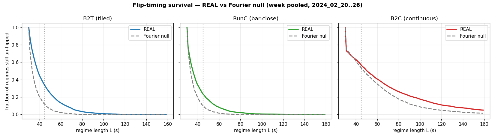
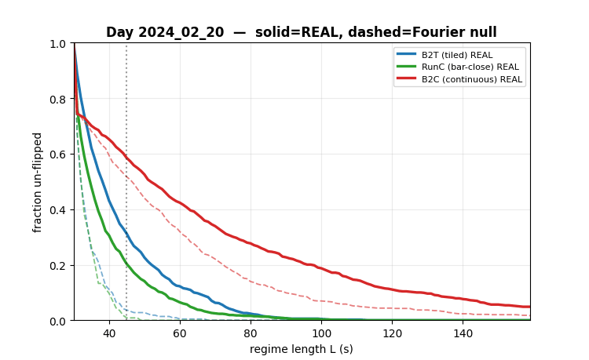
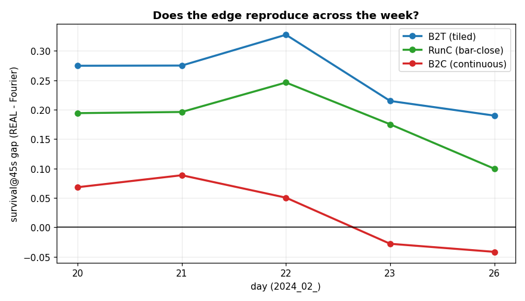
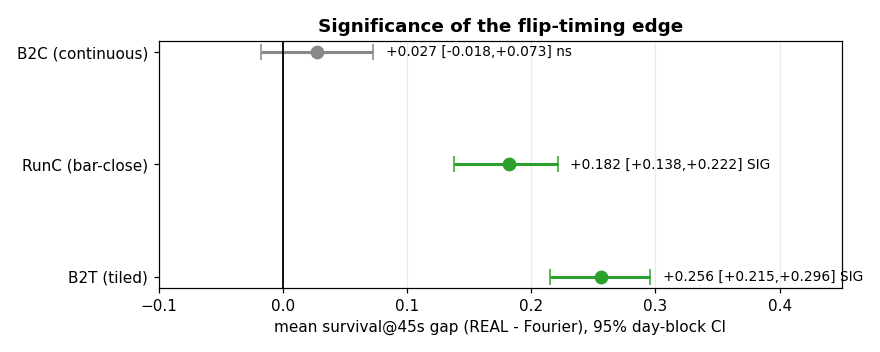

# F-Space Cadence & Flip-Timing — Week Validation Report
**Period:** 2024_02_20 → 2024_02_26 (5 contiguous Databento IS days) · **Generated:** 2026-06-21
**Scope:** tiled vs continuous F-space representations, flip-timing (regime-survival) structure, null-calibrated.

---

## TL;DR
On a full week of independent days, **bar-close representations (B2T tiled, Run C) carry a large, significant,
*reproducing* flip-timing edge** — real price regimes persist far longer than a spectrum-matched Fourier surrogate.
The **continuous representation (B2C)** — the original "sliding window from 1s" thesis — shows **no significant edge**
and does not even hold sign. **Update cadence (bar-close discretization), not window length or continuity, is the lever.**

> ⚠️ This validates *structure* (regime persistence beyond a matched-spectrum null), **not a tradeable signal yet**:
> it is flip-*timing* (when), not *direction* (which way), and it is in-sample regime persistence, not a causal forecast.

---

## 1. The question
Earlier work found (1 day) that a tiled, bar-close F-space tiers price into clean regimes that survive ~8–20× longer
than a random/surrogate null, while a continuous every-second representation washes that out. **Does it reproduce
across a week, and is it statistically significant?** Validation requires the *contrast* (tiled vs continuous), so all
three family members were run, each against its own null.

## 2. Method
- **Models:** B2T (tiled proper bars, step-filled), Run C (bar-close-sampled sliding), B2C (continuous, every-1s). All
  L1–L3, identical 5 windows (5s/15s/1m/3m/5m), identical stage-1 segmenter + corrected break rule (per-bar 10%-of-Δ,
  1-tick floor, 5-consecutive).
- **Null:** per-day **Fourier phase-randomized surrogate** — preserves the real power spectrum (autocorrelation) but
  destroys phase/nonlinear structure. Beating *this* null = structure beyond linear autocorrelation (not just "price is smooth").
- **Metric:** **survival@45s** = fraction of pristine regimes still un-flipped at 45 s (the flip-timing / persistence read).
- **Significance:** per-day gap = survival_real − survival_null; **day-block bootstrap 95% CI** across the 5 days (4,000 resamples).

## 3. Results

### 3.1 Survival curves (week-pooled) — the finding in one view
Real (solid) vs Fourier null (dashed). Bar-close separates; continuous overlaps.

### 3.2 It reproduces every day (animated)
Each frame is one day; solid = REAL, dashed = its Fourier null. The bar-close gap is present on all 5 days.

### 3.3 Per-day gap — reproduction

### 3.4 Significance (mean gap ± day-block 95% CI)

### 3.5 The numbers
| model | per-day gap @45s (20/21/22/23/26) | mean | 95% day-block CI | reproduces? |
|---|---|---|---|---|
| **B2T (tiled)** | +.27 +.28 +.33 +.21 +.19 | **+0.256** | **[+.215, +.296]** ✅ SIG | **YES (5/5)** |
| **Run C (bar-close)** | +.19 +.20 +.25 +.18 +.10 | **+0.182** | **[+.138, +.222]** ✅ SIG | **YES (5/5)** |
| **B2C (continuous)** | +.07 +.09 +.05 −.03 −.04 | +0.027 | [−.018, +.073] ❌ ns | NO (2 days negative) |

## 4. Interpretation
- **Cadence is the lever.** Bar-close discretization preserves the real-vs-null contrast; the continuous every-second
  recompute over-smooths — its real and null survival curves overlap (§3.1, right panel), and *both* persist long
  because a sliding window makes even a random walk locally linear.
- **The original continuous-sliding-window thesis is dead for this signal.** The conventional tiled bar-close
  representation is the carrier. (Tiled was nearly discarded early on as a band artifact; the corrected rule recovered it.)
- **The edge is in flip-timing/persistence:** real regimes stay regress-able far longer than a matched-spectrum null —
  structure beyond linear autocorrelation, robust across a week.

## 5. Honest boundaries (what this is NOT)
1. **Not direction, not a trade.** Survival = *when* a regime ends, not *which way* it goes. Tradeability needs the
   direction predictor + causal exploitation (untested).
2. **In-sample persistence**, not a causal forecast — segments are fit non-causally (firewall); the causal test is separate.
3. **One Fourier draw per day.** The CI is *across days* (day-block), not a per-day surrogate ensemble. A Fourier
   *ensemble* (K≈30/day) would add per-day p-values — a worthwhile refinement.
4. **L1–L3 only.** L4(λ)/L5(dist) were not in these runs; L4 didn't sharpen *survival* in the 1-day test, but its real
   axis is *direction*, untested here.

## 6. Next step
**Direction predictor — anchor → wait-N (null-anchored).** Turn the validated "*when* it flips" into "*which way*": at a
confirmed regime, wait N bars (sweep), then bet the rest of the regime; score real vs Fourier; objective = (edge-over-null)
× (remaining-move). This is the tradeable piece and where **L4/λ** finally gets tested. (Parked concepts for later:
rolling-VWAP primitive, RKHS MMD-null / kernel-ridge, OU fade-regime model, HMM — see `docs/JULES_STAGE12_MAP_OVERHAUL.md`.)

---
*Data/artifacts: `artifacts/stage1_{B2Tmap,B2Cmap,RUNCmap,WK,WKBC,WKRC}_*`. Regen: `python research/fspace_experiment/make_week_report.py`.
Numbers: `reports/findings/week_3model_contrast_2024_02.md` (via `week_analysis.py`).*
