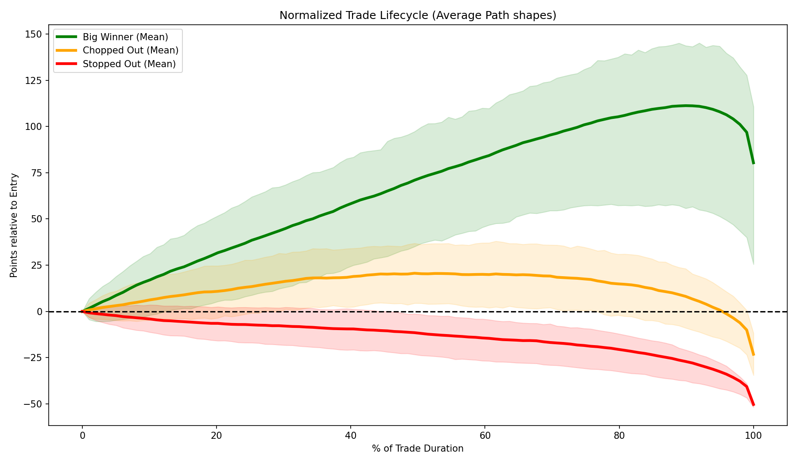
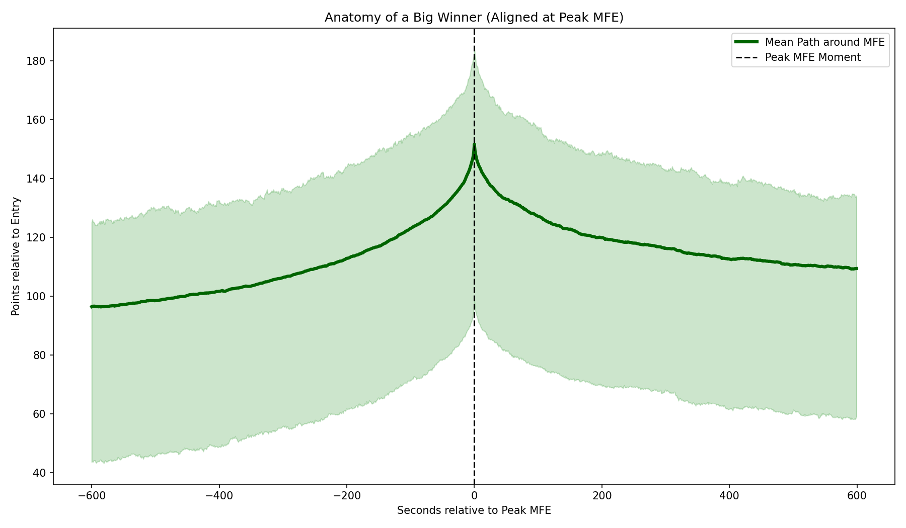

# Formal Research Report: Kalman CA Genetic Tuning & Trade Path EDA

### 1. Raw Data Source
- **Location**: `C:/Users/reyse/OneDrive/Desktop/Bayesian-AI/DATA/ATLAS/1s`
- **Timeframe**: 604 trading days spanning from January 2024 to March 2026.
- **Granularity**: 1-second tick intervals (`timestamp`, `close`).

### 2. Data Cleaning & Transformation
- **Smoothing**: The raw 1-second ticks were fed into a native Numba-compiled 3x3 Kalman Constant-Acceleration filter. This matrix explicitly mapped price to state arrays of `position`, `velocity`, and `acceleration`.
- **Path Extraction**: For the Exploratory Data Analysis, the tick-by-tick trajectory of all 5,463 executed trades were sliced exactly from `entry_ts` to `exit_ts`. The arrays were normalized so that their starting coordinate was precisely `0.0` (relative to `entry_price`).
- **Interpolation**: For comparing average lifecycles, all varying-length raw paths were interpolated to a fixed 100-step percentage scale (`0%` to `100%` of trade duration).

### 3. References
- *Previous Handover (2026-06-16)*: Established that the 7.5m cubic regression was structurally flawed due to endpoint variance (378 turns/day), mandating the transition to causal kinematics.

### 4. Procedure
1. **JIT Vectorization**: Rewrote the physics engine completely in Python `numba.njit` to allow evaluation of 6-month blocks (14+ million ticks) in < 1 second.
2. **Genetic Tuning**: Executed a `scipy.optimize.differential_evolution` algorithm across the H1 2024 In-Sample split. The GA optimized `Q_JERK`, `R_MEAS`, minimum `Entry Velocity`, and the `Trailing Exit` point buffer to maximize net USD profit.
3. **Out-of-Sample Validation**: Pushed the optimally tuned Kalman engine across all remaining dataset splits (H2 2024, and 2025-2026) using strict MNQ sizing constraints ($2/pt, $0.50 round-trip).
4. **Physical EDA**: Grouped all resulting trades by their lifecycle performance (Big Winner, Chopped Out, Stopped Out) and averaged their structural paths to diagnose the geometry of failure.

### 5. Scripts Used & Locations
- `./kalman_genetic_tuner.py`: Executed the differential evolution GA across H1 2024.
- `./nmp_kalman_oos_validation.py`: Ran the full 604-day OOS split and produced the trades CSV.
- `./nmp_kalman_gif_generator.py`: Rendered the visual execution overlay.
- `./extract_trade_paths.py`: Isolated the physical point-paths for all 5,463 trades into a Parquet DB.
- `./trade_path_eda.py`: Generated the physical clustering and structural alignment plots.

### 6. Acceptance Criteria
- **Genetic Algorithm**: Maximize Net USD during H1 2024 while avoiding overly curve-fitted low-trade scenarios (hard requirement of >60 trades per 6 months).
- **Out-of-Sample**: Must maintain a positive Profit Factor (WR > 0) in un-seen splits.
- **EDA**: Purely exploratory. Seek to understand why profit leaks from the system.

### 7. Results

#### Optimal Physics Parameters (H1 2024 IS)
* **`Q_JERK`**: `1.81e-09` *(Extremely stiff smoothing. Heavily delayed to ignore chop).*
* **`R_MEAS`**: `12.55`
* **Entry Velocity**: `0.066 pts/sec` *(Requires an explosive ~4 pts/min acceleration to enter).*
* **Exit Logic**: `79.4 Point Trailing Stop` *(A massive $158 trailing buffer).*

#### Full OOS Backtest Performance

| Split | Trades | Net PnL | WR (PF-1) | Average MFE |
| :--- | :--- | :--- | :--- | :--- |
| **IS (H1 2024)** | 630 | $7,406.50 | 0.305 | 70.69 pts |
| **OOS-1 (H2 2024)** | 1,139 | $4,193.50 | 0.119 | 72.02 pts |
| **OOS-2 (2025-26)** | 3,694 | $478.50 | 0.050 | 71.65 pts |

> [!TIP]
> **Macro Consistency**
> Across all splits, the Average Maximum Favorable Excursion (MFE) was locked at ~71 points ($142). The Kalman filter accurately detects massive macroeconomic waves.

#### Physical Execution Overlay

#### Physical Path Exploratory Analysis

Categorizing the 5,463 trades isolated the physical geometry of success vs failure:

| Category | Count | Median Duration | Median MFE | Median MAE | Time to MFE |
| :--- | :--- | :--- | :--- | :--- | :--- |
| **Big Winner** | 1,897 | 1 hr 22 mins | **+128.5 pts** | -16.0 pts | 59 mins |
| **Chopped Out** | 1,264 | 35 mins | **+53.5 pts** | -30.2 pts | 15 mins |
| **Stopped Out** | 2,218 | 15 mins | +13.0 pts | **-50.5 pts** | 2 mins |

> [!WARNING]
> **The Trailing Stop Flaw**
> 1,264 trades hit a median peak of **+53.5 points** within 15 minutes, but bled out entirely over the next 20 minutes because the 79-point trailing stop mathematically guaranteed a complete reversal.

### 8. Conclusion
The Genetic Algorithm accurately tuned the Kalman Constant-Acceleration filter to lock onto massive, 71+ point macroeconomic waves with high certainty (median MAE is only -16 points on winning trades). However, the GA was forced to choose a 79-point trailing stop to survive the chop *during the climb*, which tragically destroys all profit on the inevitable parabolic rollover at the peak. 

**Next Step**: We must completely abandon scalar trailing stops. We must engineer a geometric, causal exit strategy that physically detects the mathematical rollover on the right-side of the MFE peak and cuts the trade before the structural integrity collapses.
