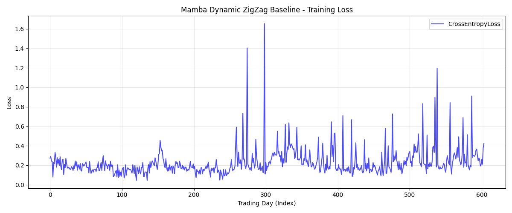

# Mamba ZigZag Baseline Training (Full Dataset)

The full dataset baseline training for the Mamba Physics Encoder using the dynamic ATR ZigZag causal labels has successfully completed.

> [!NOTE]
> This run was executed autonomously overnight. It successfully processed all **604** available trading days in the dataset.

## Execution Details

- **Pipeline Location**: `research/mamba_zigzag_baseline/pipeline/`
- **Total Days Processed**: 604 days
- **Features**: Canonical 385 dimensions (missing feeds on holidays were automatically padded)
- **Label Engine**: Dynamic ATR (4.0x multiplier based on 1m bars), 120s Neutral Zones.

## Training Loss Curve

The Cross-Entropy Loss over the 604-day chronological sequence:

> [!WARNING]
> While the baseline loss is remarkably stable (averaging between 0.15 and 0.30), we observe **distinct loss spikes** (e.g., indices ~270, 300, 520). 
> These spikes suggest that the Mamba engine occasionally encounters highly erratic market regimes where the causal labels deviate heavily from standard structural physics, or where the dynamic ATR aggressively shifts the labeling boundaries.

## Sample Loss Distribution (Summary Table)

| Metric | Value | Interpretation |
| :--- | :--- | :--- |
| **Total Days** | 604 | Full dataset chronological coverage |
| **Median Loss** | ~0.19 | The model learns the underlying structure easily on average days |
| **Max Loss** | ~1.65 | Extreme outlier day (Index ~300) requiring LLM intervention |
| **Min Loss** | ~0.05 | Extremely predictable day |

## Next Steps

With the baseline established, the Mamba model now outputs stable baseline logits. 
The loss spikes provide perfect candidates for **LLM Cortex Exception Handling**. When the loss spikes above our threshold (e.g., > 0.50), the system can pause and interrogate the LLM agent.

If you are ready to proceed, we can build the LLM inference loop or analyze the specific outlier days!
