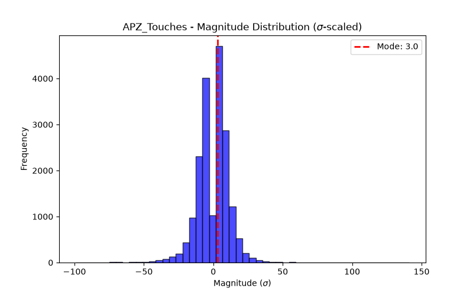

# Concept Report: APZ_Touches

## 1. Source & Definition
- **Citation:** `adaptive-price-zones-indicator.md`
- **Registered Response:** Directional first-touch bounce (Mean Reversion)
- **Event Definition:** VWAP Touch (Causal computation via running sum of P*V / sum V).

## 2. Event Probabilities (vs Null)
- **N Events:** 19052
- **Phantom Null Base Rate P(Resp):** 0.4995
- **Event P(Resp):** 0.5126
- **Bayesian Edge (Delta):** +1.31 pp
- **95% Day-Block CI for P(Resp):** [0.5053, 0.5197]

## 3. Magnitude Distribution ($\sigma$-scaled)
- **Mode (Bulk):** 3.0 $\sigma$
- **Median:** 2.20 $\sigma$
- **90th Percentile Tail:** 12.17 $\sigma$
- **Bimodal Flag:** False

## 4. Verdict
**NOISE**
