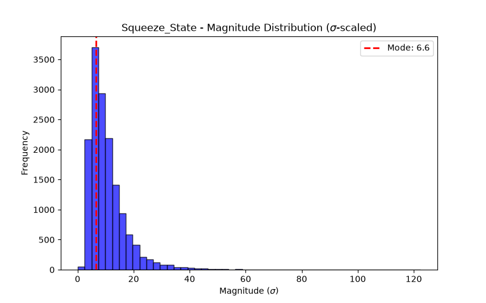

# Concept Report: Squeeze_State

## 1. Source & Definition
- **Citation:** `bollinger-bands-explained-a-futures-traders-guide.md`
- **Registered Response:** Volatility Expansion (Direction-Free Breakout)
- **Event Definition:** VWAP Touch (Causal computation via running sum of P*V / sum V).

## 2. Event Probabilities (vs Null)
- **N Events:** 15304
- **Phantom Null Base Rate P(Resp):** 0.9986
- **Event P(Resp):** 0.9993
- **Bayesian Edge (Delta):** +0.06 pp
- **95% Day-Block CI for P(Resp):** [0.9988, 0.9999]

## 3. Magnitude Distribution ($\sigma$-scaled)
- **Mode (Bulk):** 6.6 $\sigma$
- **Median:** 8.77 $\sigma$
- **90th Percentile Tail:** 18.68 $\sigma$
- **Bimodal Flag:** True

## 4. Verdict
**NOISE**
