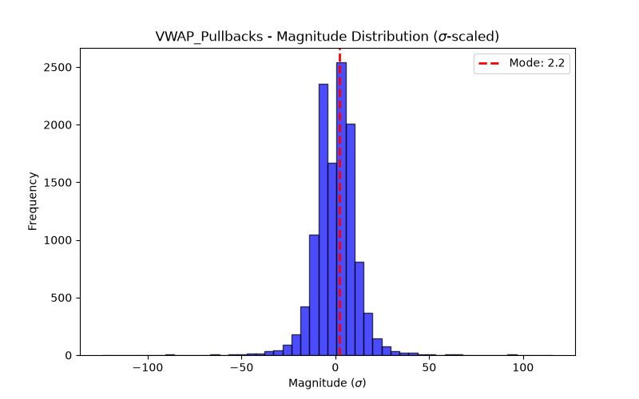

# Concept Report: VWAP_Pullbacks

## 1. Source & Definition
- **Citation:** `what-is-volume-weighted-average-price-vwap.md`
- **Registered Response:** Directional first-touch bounce (+2 sigma)
- **Event Definition:** VWAP Touch (Causal computation via running sum of P*V / sum V).

## 2. Event Probabilities (vs Null)
- **N Events:** 11983
- **Phantom Null Base Rate P(Resp):** 0.4968
- **Event P(Resp):** 0.5079
- **Bayesian Edge (Delta):** +1.11 pp
- **95% Day-Block CI for P(Resp):** [0.5021, 0.5133]

## 3. Magnitude Distribution ($\sigma$-scaled)
- **Mode (Bulk):** 2.2 $\sigma$
- **Median:** 2.12 $\sigma$
- **90th Percentile Tail:** 11.62 $\sigma$
- **Bimodal Flag:** False

## 4. Verdict
**NOISE**
