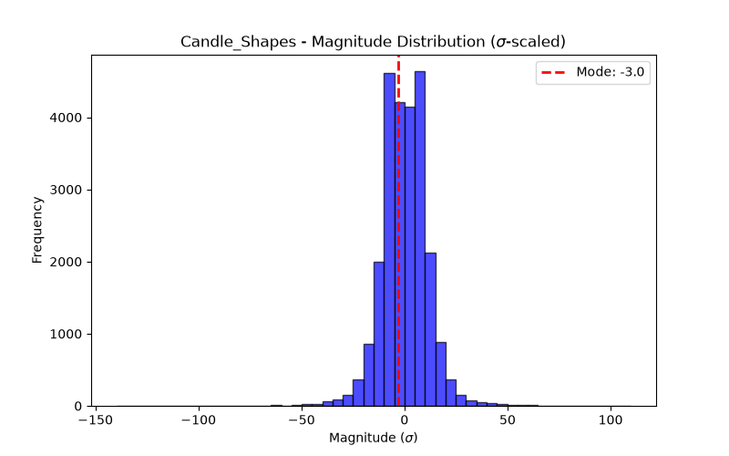

# Concept Report: Candle_Shapes

## 1. Source & Definition
- **Citation:** `5-key-indicators-for-day-trading-futures.md`
- **Registered Response:** Directional Continuation (+2 sigma)
- **Event Definition:** Candle_Shapes

## 2. Event Probabilities (vs Null)
- **N Events:** 24999
- **Phantom Null Base Rate P(Resp):** 0.4992
- **Event P(Resp):** 0.5020
- **Bayesian Edge (Delta):** +0.28 pp
- **95% Day-Block CI for P(Resp):** [0.4974, 0.5066]

## 3. Magnitude Distribution ($\sigma$-scaled)
- **Mode (Bulk):** -3.0 $\sigma$
- **Median:** 2.02 $\sigma$
- **90th Percentile Tail:** 12.34 $\sigma$
- **Bimodal Flag:** True

## 4. Verdict
**NOISE**
