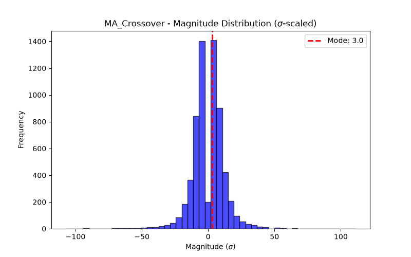

# Concept Report: MA_Crossover

## 1. Source & Definition
- **Citation:** `how-to-choose-your-technical-indicators.md`
- **Registered Response:** Trend Continuation (+2 sigma)
- **Event Definition:** MA_Crossover

## 2. Event Probabilities (vs Null)
- **N Events:** 6410
- **Phantom Null Base Rate P(Resp):** 0.4970
- **Event P(Resp):** 0.4992
- **Bayesian Edge (Delta):** +0.22 pp
- **95% Day-Block CI for P(Resp):** [0.4896, 0.5086]

## 3. Magnitude Distribution ($\sigma$-scaled)
- **Mode (Bulk):** 3.0 $\sigma$
- **Median:** -0.68 $\sigma$
- **90th Percentile Tail:** 12.60 $\sigma$
- **Bimodal Flag:** True

## 4. Verdict
**NOISE**
