# Phase-5 F-space Discriminator — Visual Gallery (20 tests)
**Generated 2026-07-11.** Each plot = the discriminator's 2025 FORWARD branch
magnitude distributions (ACT take / SKIP / INVERT ride), thresholds frozen on 2024.
Purple = mode, green = median, red = mean. **Read mode-first.**

How to read: a TAKEABLE branch is a tight cluster clearly off zero (mode away from 0,
few opposite-tail outliers). A LOTTERY branch has mass near/opposite 0 with a few huge
outliers dragging the mean far from the mode. NOISE = ACT/INVERT look like SKIP.

## Candidates with visible structure (tight cluster off zero)
- **ATR-09** — INVERT ride: tight +10..+13 cluster, 90%+ win, BUT 4 disaster tails
  (−180..−223). Structure real; tail not differentiable from entry F-space (full
  918-feat ladder tested — still 4 disasters). 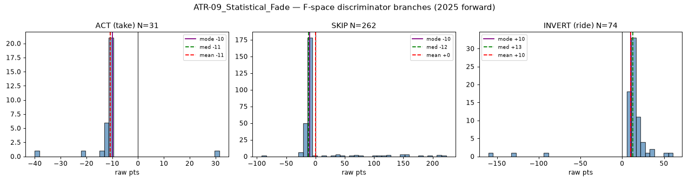
- **PIVOT-16** — INVERT: clean +12 cluster, 100% win, N small (underpowered).
  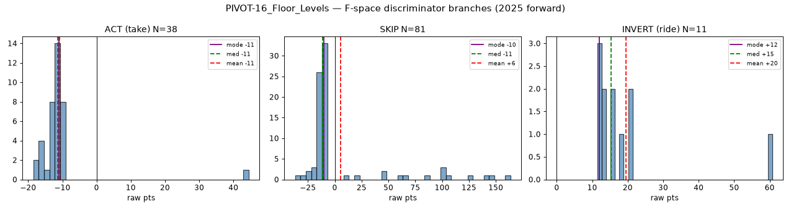
- **ROUND-05** — ACT: +12 cluster, 80% win, underpowered. 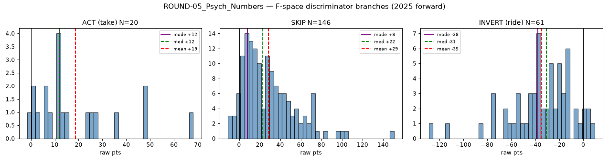
- **ORB-02** — INVERT: +50 cluster, borderline N. 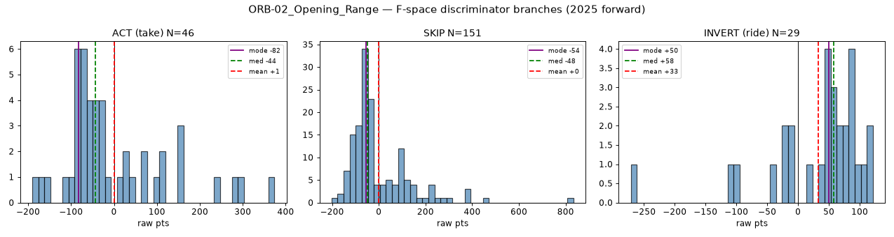

## Lottery (mean far from mode — outlier-carried, do NOT trust the EV)
- **SEASON-12** — right-skew gap magnitudes; mean +94 vs mode +6. 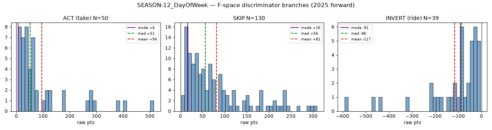
- **RSI-06** — magnitudes to ±1000-2000; mean carried by huge swings. 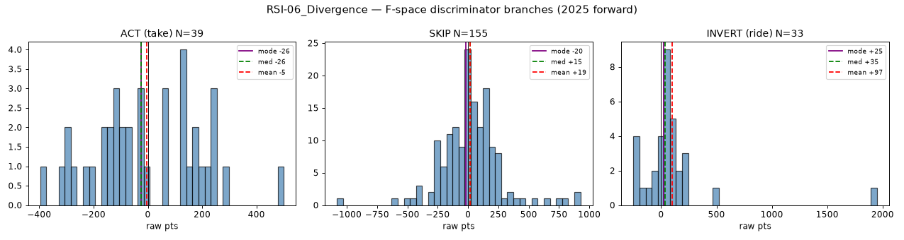
- **SQZ-04** — few events, huge magnitudes. 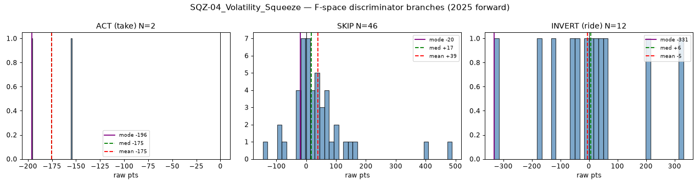
- **CROSS-11** — ±200-274 swings, tiny N. 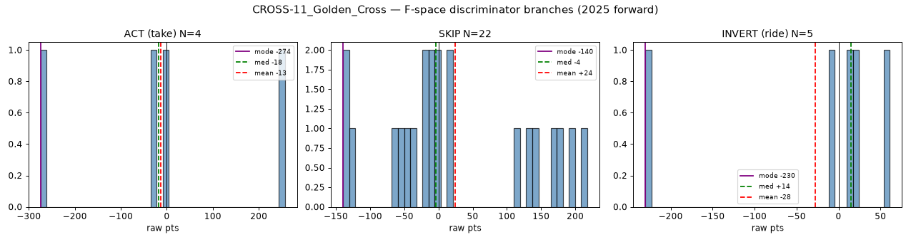

## Null (ACT/INVERT ≈ SKIP; high-N = decisive)
- **DOW-19** (33k) 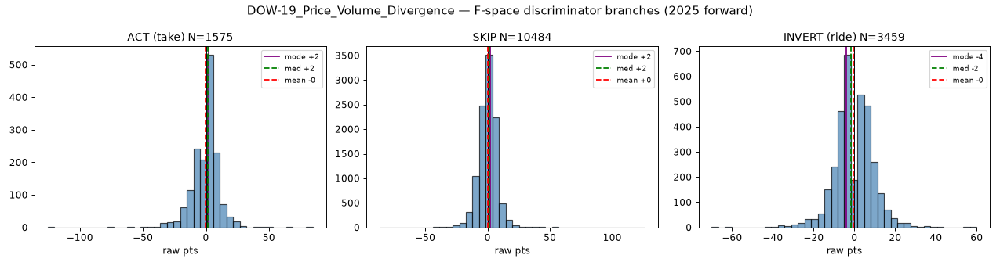
- **SAR-23** (33k) 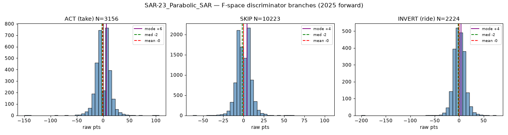
- **TUNNEL-20** (32k) 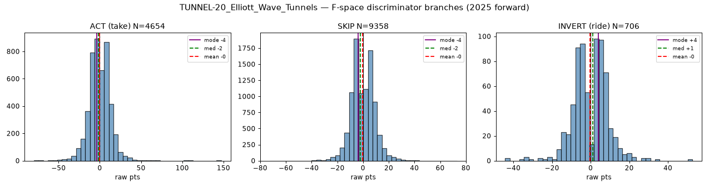
- **ZONE-21** (3k) 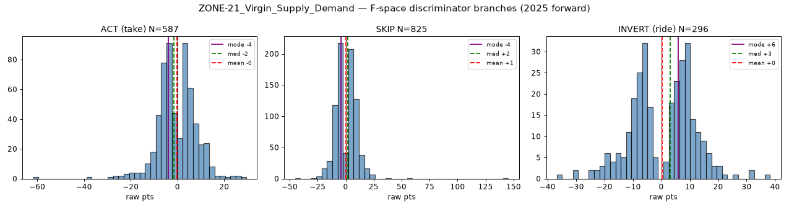
- **MACD-07** 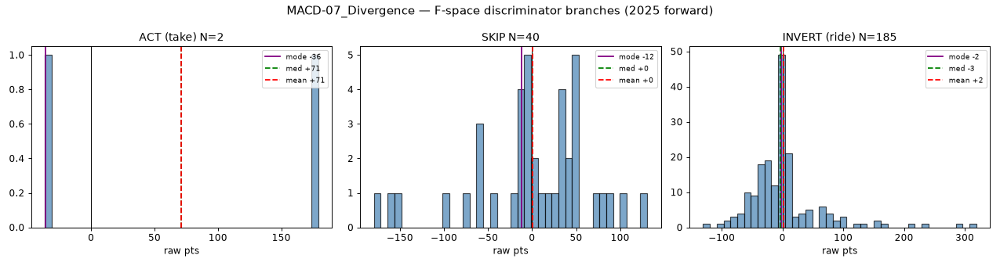
- **VWMA-10** 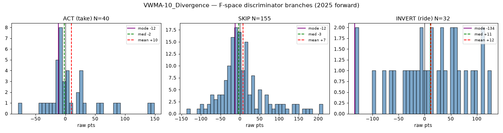
- **VWAP-03** 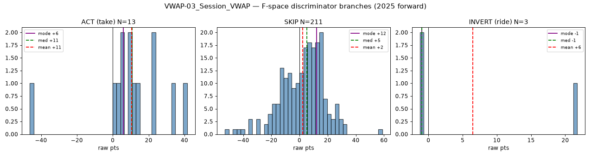
- **VP-01** 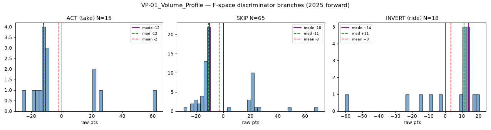
- **OHLC-01** 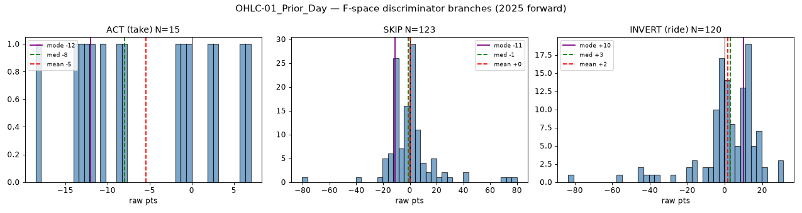
- **HNS-22** 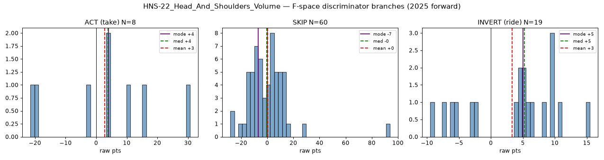
- **VA-13** 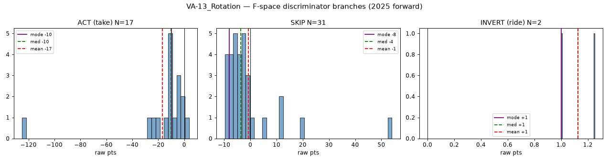
- **FIB-17** (thin) 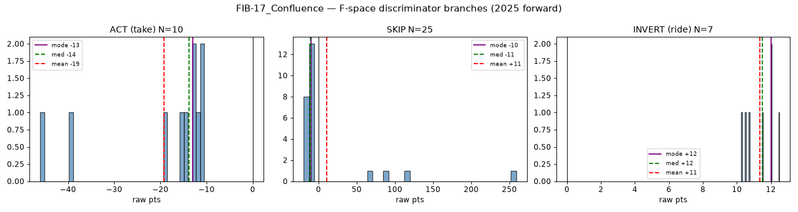

## Not plotted (excluded)
ADX-08, SCALP-18 (thin <30/yr), ORDERFLOW-14 (2025/26 only), RENKO-24 (brick index).

> These are the 5s single-bar-snapshot discriminator branches. The multi-TF telescoping
> ladder was tested on ATR-09 (918 feats) and did NOT improve differentiation -> entry
> F-space cannot separate the good rides from the catastrophic ones; the tail needs an
> EXIT rule, not entry selection.
