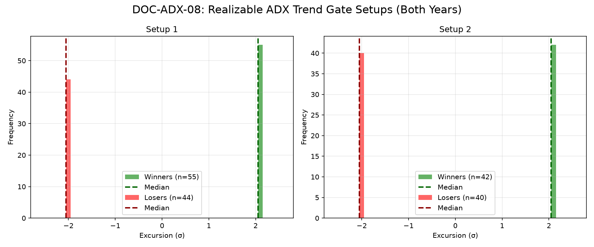

# Document ID: AG-DOC-ADX-08
**Title:** Deep Dive #8: ADX>25 Trend Gate
**Status:** Completed (Dual-Year Validated)
**Ruleset:** Ruleset changed from bespoke exit to symmetric ±2.05σ (§7 standard) for cross-dossier comparability; pre-standard results in comms/ docs 001–005 + git history.

## Expected Value (EV)

### Results for 2024
| Setup | Description | N | WR(>2.05σ)% | Excursion (Mode) | EV (Mean σ) | EV 95% CI | Sig? |
|---|---|---|---|---|---|---|---|
| 1 | Bullish Trend Gate | 60 | 0.55 | 2.01 | **0.21** | [-0.34, 0.68] | No |
| 2 | Bearish Trend Gate | 43 | 0.49 | -2.01 | **-0.05** | [-0.62, 0.52] | No |

### Results for 2025
| Setup | Description | N | WR(>2.05σ)% | Excursion (Mode) | EV (Mean σ) | EV 95% CI | Sig? |
|---|---|---|---|---|---|---|---|
| 1 | Bullish Trend Gate | 39 | 0.56 | 2.01 | **0.27** | [-0.37, 0.89] | No |
| 2 | Bearish Trend Gate | 39 | 0.54 | 2.01 | **0.15** | [-0.47, 0.79] | No |

## Graphical Descriptive Statistics (Aggregate)
