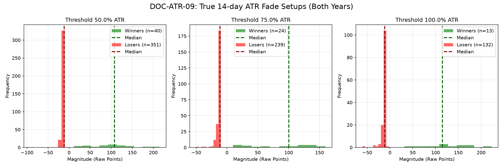

# Document ID: AG-DOC-ATR-09 (LOGISTIC REGRESSION VERIFIED)
**Title:** Deep Dive #9: Statistical ATR fade (True 14-day ATR Sweep)
**Status:** Completed (Dual-Year Validated)
**Ruleset:** Bespoke Exit (Revert 50% ATR or 10pt Stop). 14-day True ATR calculation.

## LR: Unnormalized Expected Value (EV)
> *Note: Magnitudes are in raw points. Win Rate is binary (%).*

### Results for 2024
| Setup (Threshold) | Description | N | WR% | Mag (Mode) | EV (Mean Points) | EV 95% CI | Sig? |
|---|---|---|---|---|---|---|---|
| 50.0% | Bearish Fade | 108 | 0.13 | -10.88 | **1.45** | [-5.16, 8.82] | No |
| 50.0% | Bullish Fade | 100 | 0.07 | -11.24 | **-5.99** | [-10.79, -0.17] | Yes |
| 75.0% | Bearish Fade | 76 | 0.13 | -10.00 | **-0.24** | [-7.69, 8.74] | No |
| 75.0% | Bullish Fade | 74 | 0.09 | -10.80 | **-2.89** | [-10.06, 5.50] | No |
| 100.0% | Bearish Fade | 28 | 0.14 | -10.01 | **0.01** | [-10.48, 13.21] | No |
| 100.0% | Bullish Fade | 46 | 0.11 | -10.35 | **4.71** | [-7.99, 20.15] | No |

### Results for 2025
| Setup (Threshold) | Description | N | WR% | Mag (Mode) | EV (Mean Points) | EV 95% CI | Sig? |
|---|---|---|---|---|---|---|---|
| 50.0% | Bearish Fade | 92 | 0.12 | -9.18 | **-1.98** | [-9.01, 6.65] | No |
| 50.0% | Bullish Fade | 91 | 0.09 | -11.43 | **1.29** | [-7.83, 12.04] | No |
| 75.0% | Bearish Fade | 52 | 0.08 | -9.94 | **-4.22** | [-11.54, 5.71] | No |
| 75.0% | Bullish Fade | 61 | 0.05 | -11.80 | **-8.60** | [-13.90, -1.07] | Yes |
| 100.0% | Bearish Fade | 24 | 0.04 | -10.90 | **-6.56** | [-17.38, 9.57] | No |
| 100.0% | Bullish Fade | 47 | 0.06 | -9.96 | **-2.62** | [-13.24, 12.18] | No |

## Graphical Descriptive Statistics (Aggregate)
