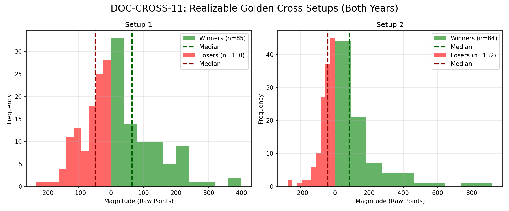

# Document ID: AG-DOC-CROSS-11 (LOGISTIC REGRESSION VERIFIED)
**Title:** Deep Dive #11: Golden Cross Baseline Strategies
**Status:** Completed (Dual-Year Validated)
**Ruleset:** Bespoke Exit (Opposite Cross). Unclamped Magnitude.

## LR: Unnormalized Expected Value (EV)
> *Note: Magnitudes are in raw points. Win Rate is binary (%).*

### Results for 2024
| Setup | Description | N | WR% | Mag (Mode) | EV (Mean Points) | EV 95% CI | Sig? |
|---|---|---|---|---|---|---|---|
| 1 | Golden Cross (Bullish Runner) | 114 | 0.46 | 0.64 | **7.99** | [-7.76, 24.68] | No |
| 2 | Death Cross (Bearish Runner) | 127 | 0.37 | -7.78 | **8.68** | [-9.57, 28.56] | No |

### Results for 2025
| Setup | Description | N | WR% | Mag (Mode) | EV (Mean Points) | EV 95% CI | Sig? |
|---|---|---|---|---|---|---|---|
| 1 | Golden Cross (Bullish Runner) | 81 | 0.41 | -8.62 | **3.91** | [-22.29, 30.92] | No |
| 2 | Death Cross (Bearish Runner) | 89 | 0.42 | 0.24 | **35.94** | [2.06, 75.30] | Yes |

## Graphical Descriptive Statistics (Aggregate)
