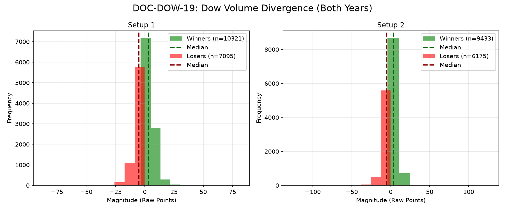

# Document ID: AG-DOC-DOW-19
**Title:** Deep Dive #19: Dow Price-Volume Divergence
**Status:** Completed (Dual-Year Validated)
**Ruleset:** Exit (Mean Revert to SMA-20 or 3.0$\sigma$ Stop).

## LR: Unnormalized Expected Value (EV)
> *Note: Magnitudes are in raw points. Win Rate is binary (%).*

### Results for 2024
| Setup | Description | N | WR% | Mag (Mode) | EV (Mean Points) | EV 95% CI | Sig? |
|---|---|---|---|---|---|---|---|
| 1 | Bearish Trap | 9353 | 0.58 | 2.51 | **0.05** | [-0.06, 0.16] | No |
| 2 | Bullish Trap | 8153 | 0.60 | 2.17 | **0.06** | [-0.06, 0.19] | No |

### Results for 2025
| Setup | Description | N | WR% | Mag (Mode) | EV (Mean Points) | EV 95% CI | Sig? |
|---|---|---|---|---|---|---|---|
| 1 | Bearish Trap | 8063 | 0.59 | 2.28 | **0.20** | [0.02, 0.39] | Yes |
| 2 | Bullish Trap | 7455 | 0.59 | 2.77 | **0.25** | [0.05, 0.46] | Yes |

## Graphical Descriptive Statistics (Aggregate)
