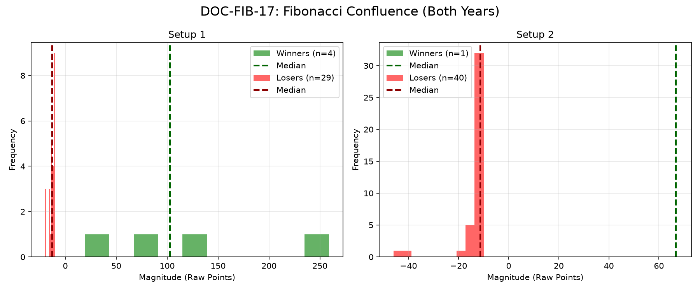

# Document ID: AG-DOC-FIB-17 (LOGISTIC REGRESSION VERIFIED)
**Title:** Deep Dive #17: Fibonacci Confluence + ADX
**Status:** Completed (Dual-Year Validated)
**Ruleset:** Bespoke Exit (Target Swing H/L or 10pt Stop). Unclamped Magnitude.

## LR: Unnormalized Expected Value (EV)
> *Note: Magnitudes are in raw points. Win Rate is binary (%).*

### Results for 2024
| Setup | Description | N | WR% | Mag (Mode) | EV (Mean Points) | EV 95% CI | Sig? |
|---|---|---|---|---|---|---|---|
| 1 | Bullish Pullback (UP Trend) | 13 | 0.08 | -19.36 | **-10.98** | [-14.79, -5.35] | Yes |
| 2 | Bearish Pullback (DOWN Trend) | 19 | 0.00 | -10.06 | **-11.66** | [-12.43, -10.97] | Yes |

### Results for 2025
| Setup | Description | N | WR% | Mag (Mode) | EV (Mean Points) | EV 95% CI | Sig? |
|---|---|---|---|---|---|---|---|
| 1 | Bullish Pullback (UP Trend) | 20 | 0.15 | -11.15 | **12.58** | [-12.64, 46.40] | No |
| 2 | Bearish Pullback (DOWN Trend) | 22 | 0.05 | -11.05 | **-11.17** | [-17.99, -2.32] | Yes |

## Graphical Descriptive Statistics (Aggregate)
