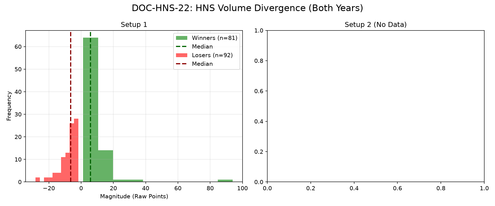

# Document ID: AG-DOC-HNS-22
**Title:** Deep Dive #22: Head and Shoulders Volume Divergence
**Status:** Completed (Dual-Year Validated)
**Ruleset:** Neckline Breakdown 3.0$\sigma$ Target / 3.0$\sigma$ Stop.

## LR: Unnormalized Expected Value (EV)
> *Note: Magnitudes are in raw points. Win Rate is binary (%).*

### Results for 2024
| Setup | Description | N | WR% | Mag (Mode) | EV (Mean Points) | EV 95% CI | Sig? |
|---|---|---|---|---|---|---|---|
| 1 | HNS Breakdown | 86 | 0.47 | -2.53 | **-0.25** | [-1.67, 1.21] | No |

### Results for 2025
| Setup | Description | N | WR% | Mag (Mode) | EV (Mean Points) | EV 95% CI | Sig? |
|---|---|---|---|---|---|---|---|
| 1 | HNS Breakdown | 87 | 0.47 | -7.47 | **-0.32** | [-3.22, 3.04] | No |

## Graphical Descriptive Statistics (Aggregate)
