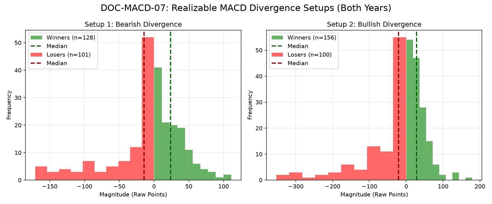

# Document ID: AG-DOC-MACD-07 (LOGISTIC REGRESSION VERIFIED)
**Title:** Deep Dive #7: MACD Divergence
**Status:** Completed (Dual-Year Validated)
**Ruleset:** Bespoke Exit (MACD Mean Reverts to 0 or EOD). Unclamped Magnitude.

## LR: Unnormalized Expected Value (EV)
> *Note: Magnitudes are in raw points. Win Rate is binary (%).*

### Results for 2024
| Setup | Description | N | WR% | Mag (Mode) | EV (Mean Points) | EV 95% CI | Sig? |
|---|---|---|---|---|---|---|---|
| 1 | Bearish Divergence | 125 | 0.58 | 2.19 | **-4.26** | [-13.62, 4.88] | No |
| 2 | Bullish Divergence | 133 | 0.61 | -1.83 | **-10.28** | [-23.58, 2.08] | No |

### Results for 2025
| Setup | Description | N | WR% | Mag (Mode) | EV (Mean Points) | EV 95% CI | Sig? |
|---|---|---|---|---|---|---|---|
| 1 | Bearish Divergence | 104 | 0.54 | -5.14 | **-1.02** | [-10.28, 7.69] | No |
| 2 | Bullish Divergence | 123 | 0.61 | 4.70 | **-0.80** | [-14.19, 11.17] | No |

## Graphical Descriptive Statistics (Aggregate)
