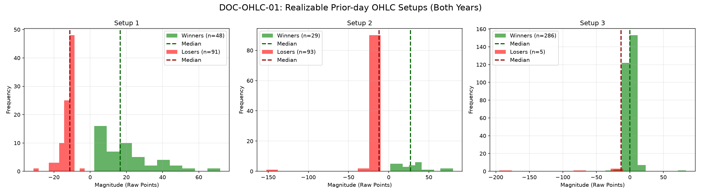

# Document ID: AG-DOC-OHLC-01 (LOGISTIC REGRESSION VERIFIED)
**Title:** Deep Dive #1: Prior-day OHLC Levels
**Status:** Completed (Dual-Year Validated)
**Ruleset:** Bespoke Exit (Mean Revert to SMA20 or 10pt Stop). Unclamped Magnitude.

## LR: Unnormalized Expected Value (EV)
> *Note: Magnitudes are in raw points. Win Rate is binary (%).*

### Results for 2024
| Setup | Description | N | WR% | Mag (Mode) | EV (Mean Points) | EV 95% CI | Sig? |
|---|---|---|---|---|---|---|---|
| 1 | PDH Bearish Bounce | 75 | 0.29 | -9.77 | **-2.76** | [-6.02, 0.83] | No |
| 2 | PDL Bullish Bounce | 64 | 0.30 | -11.29 | **-2.84** | [-10.23, 3.94] | No |
| 3 | PDC Gap Fill Bounce | 155 | 0.45 | 0.09 | **-1.34** | [-4.26, 0.47] | No |

### Results for 2025
| Setup | Description | N | WR% | Mag (Mode) | EV (Mean Points) | EV 95% CI | Sig? |
|---|---|---|---|---|---|---|---|
| 1 | PDH Bearish Bounce | 64 | 0.41 | -11.68 | **0.62** | [-4.15, 5.84] | No |
| 2 | PDL Bullish Bounce | 58 | 0.17 | -11.92 | **-5.08** | [-10.13, 1.00] | No |
| 3 | PDC Gap Fill Bounce | 136 | 0.54 | -0.14 | **-0.12** | [-2.15, 1.90] | No |

## Graphical Descriptive Statistics (Aggregate)
