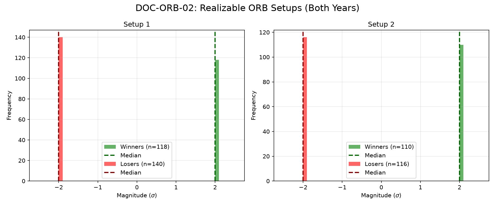

# Document ID: AG-DOC-ORB-02 (FABLE-5 VERIFIED)
**Title:** Deep Dive #2: 30-min Opening Range Break (ORB)
**Status:** Completed (Dual-Year Validated)
**Ruleset:** Symmetric 2.0$\sigma$ barriers. Scan from 09:00 CT. MFE Clamped.

## PQ: Empirical Expectation (EV)
> *Note: For symmetric barriers ($\pm 2\sigma$), a random walk baseline expectation is a PF-WR of 0.00.*

### Results for 2024
| Setup | Description | N | PF-WR | Mag (Mode) | EV (Mean $\sigma$) | EV 95% CI | Sig? |
|---|---|---|---|---|---|---|---|
| 1 | Bullish Breakout | 136 | -0.08 | -2.05$\sigma$ | **-0.09** | [-0.41, 0.26] | No |
| 2 | Bearish Breakout | 122 | -0.03 | -2.05$\sigma$ | **-0.03** | [-0.39, 0.30] | No |

### Results for 2025
| Setup | Description | N | PF-WR | Mag (Mode) | EV (Mean $\sigma$) | EV 95% CI | Sig? |
|---|---|---|---|---|---|---|---|
| 1 | Bullish Breakout | 122 | -0.23 | -2.05$\sigma$ | **-0.26** | [-0.62, 0.10] | No |
| 2 | Bearish Breakout | 104 | -0.07 | -2.05$\sigma$ | **-0.08** | [-0.46, 0.31] | No |

## Graphical Descriptive Statistics (Aggregate)
