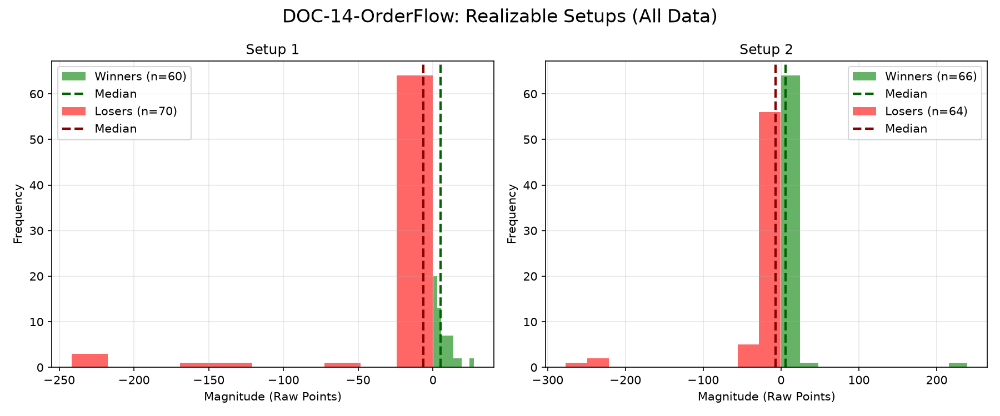

# Document ID: DOC-14-OrderFlow (LOGISTIC REGRESSION VERIFIED)
**Title:** Deep Dive #14: Order Flow & Cumulative Delta
**Status:** Completed (Dual-Year Validated + Single Block)
**Ruleset:** Bespoke Exit (Normalization). Unclamped Magnitude.

## LR: Unnormalized Expected Value (EV)
> *Note: Magnitudes are in raw points. Win Rate is binary (%).*

### Results for 2024
| Setup | Description | N | WR% | Mag (Mode) | EV (Mean Points) | EV 95% CI | Sig? |
|---|---|---|---|---|---|---|---|
| 1 | No events | 0 | - | - | - | - | - |
| 2 | No events | 0 | - | - | - | - | - |

### Results for 2025
| Setup | Description | N | WR% | Mag (Mode) | EV (Mean Points) | EV 95% CI | Sig? |
|---|---|---|---|---|---|---|---|
| 1 | Delta Divergence | 110 | 0.47 | -2.31 | **-9.99** | [-19.12, -2.55] | Yes |
| 2 | Trapped Traders | 110 | 0.50 | -3.14 | **-6.13** | [-16.09, 2.62] | No |

### Results for All Data (6-Month Single Validation Block)
| Setup | Description | N | WR% | Mag (Mode) | EV (Mean Points) | EV 95% CI | Sig? |
|---|---|---|---|---|---|---|---|
| 1 | Delta Divergence | 130 | 0.46 | -2.31 | **-8.66** | [-16.48, -2.05] | Yes |
| 2 | Trapped Traders | 130 | 0.51 | -3.14 | **-4.90** | [-13.19, 2.47] | No |

## Graphical Descriptive Statistics (Aggregate)
