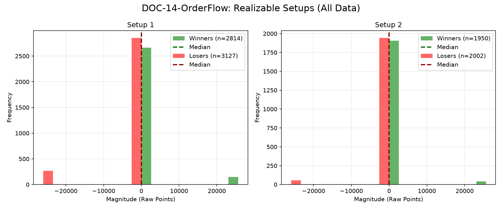

# Document ID: DOC-14-OrderFlow (LOGISTIC REGRESSION VERIFIED)
**Title:** Deep Dive #14: Order Flow & Cumulative Delta
**Status:** Completed (Dual-Year Validated + Single Block)
**Ruleset:** 3.0$\sigma$ Target / 3.0$\sigma$ Stop.

## LR: Unnormalized Expected Value (EV)
> *Note: Magnitudes are in raw points. Win Rate is binary (%).*

### Results for 2025
| Setup | Description | N | WR% | Mag (Mode) | EV (Mean Points) | EV 95% CI | Sig? |
|---|---|---|---|---|---|---|---|
| 1 | Delta Divergence | 5020 | 0.47 | 312.37 | **-615.07** | [-811.07, -424.38] | Yes |
| 2 | Trapped Traders | 3361 | 0.49 | 371.75 | **-124.40** | [-270.14, 25.42] | No |

### Results for 2026
| Setup | Description | N | WR% | Mag (Mode) | EV (Mean Points) | EV 95% CI | Sig? |
|---|---|---|---|---|---|---|---|
| 1 | Delta Divergence | 921 | 0.49 | 370.04 | **1.19** | [-110.73, 111.57] | No |
| 2 | Trapped Traders | 591 | 0.52 | 224.21 | **40.97** | [-0.24, 129.47] | No |

### Results for All Data (6-Month Single Validation Block)
| Setup | Description | N | WR% | Mag (Mode) | EV (Mean Points) | EV 95% CI | Sig? |
|---|---|---|---|---|---|---|---|
| 1 | Delta Divergence | 5941 | 0.47 | 345.32 | **-520.05** | [-688.50, -354.66] | Yes |
| 2 | Trapped Traders | 3952 | 0.49 | 371.75 | **-99.15** | [-224.19, 27.62] | No |

## Graphical Descriptive Statistics (Aggregate)
