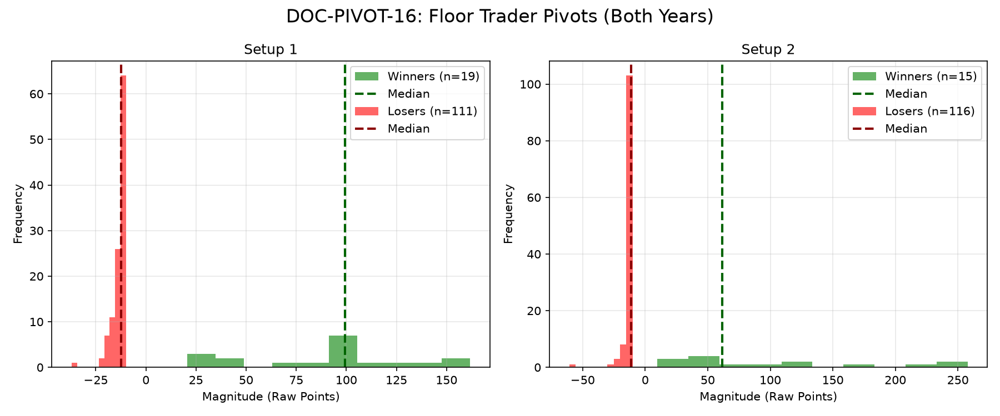

# Document ID: AG-DOC-PIVOT-16 (LOGISTIC REGRESSION VERIFIED)
**Title:** Deep Dive #16: Floor Trader Pivots (R1/S1)
**Status:** Completed (Dual-Year Validated)
**Ruleset:** Bespoke Exit (Target PP or 10pt Stop). Unclamped Magnitude.

## LR: Unnormalized Expected Value (EV)
> *Note: Magnitudes are in raw points. Win Rate is binary (%).*

### Results for 2024
| Setup | Description | N | WR% | Mag (Mode) | EV (Mean Points) | EV 95% CI | Sig? |
|---|---|---|---|---|---|---|---|
| 1 | S1 Bullish Bounce | 67 | 0.13 | -11.39 | **0.30** | [-7.97, 9.84] | No |
| 2 | R1 Bearish Bounce | 64 | 0.14 | -12.88 | **6.62** | [-5.96, 22.41] | No |

### Results for 2025
| Setup | Description | N | WR% | Mag (Mode) | EV (Mean Points) | EV 95% CI | Sig? |
|---|---|---|---|---|---|---|---|
| 1 | S1 Bullish Bounce | 63 | 0.16 | -12.92 | **3.07** | [-6.28, 14.17] | No |
| 2 | R1 Bearish Bounce | 67 | 0.09 | -9.11 | **-5.24** | [-11.79, 2.99] | No |

## Graphical Descriptive Statistics (Aggregate)
