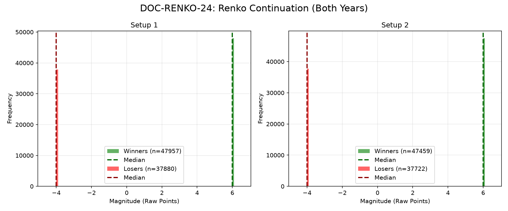

# Document ID: AG-DOC-RENKO-24
**Title:** Deep Dive #24: Renko Time Filtering (2-Point Bricks)
**Status:** Completed (Dual-Year Validated)
**Ruleset:** Trend Continuation on 2nd Brick. Target: 3 Bricks, Stop: 2 Bricks.

## LR: Unnormalized Expected Value (EV)
> *Note: Magnitudes are in raw points. Win Rate is binary (%).*

### Results for 2024
| Setup | Description | N | WR% | Mag (Mode) | EV (Mean Points) | EV 95% CI | Sig? |
|---|---|---|---|---|---|---|---|
| 1 | Bullish Continuation | 37742 | 0.54 | 5.90 | **1.36** | [1.31, 1.41] | Yes |
| 2 | Bearish Continuation | 37381 | 0.53 | 5.90 | **1.31** | [1.26, 1.36] | Yes |

### Results for 2025
| Setup | Description | N | WR% | Mag (Mode) | EV (Mean Points) | EV 95% CI | Sig? |
|---|---|---|---|---|---|---|---|
| 1 | Bullish Continuation | 48095 | 0.58 | 5.90 | **1.77** | [1.72, 1.81] | Yes |
| 2 | Bearish Continuation | 47800 | 0.58 | 5.90 | **1.77** | [1.73, 1.82] | Yes |

## Graphical Descriptive Statistics (Aggregate)
