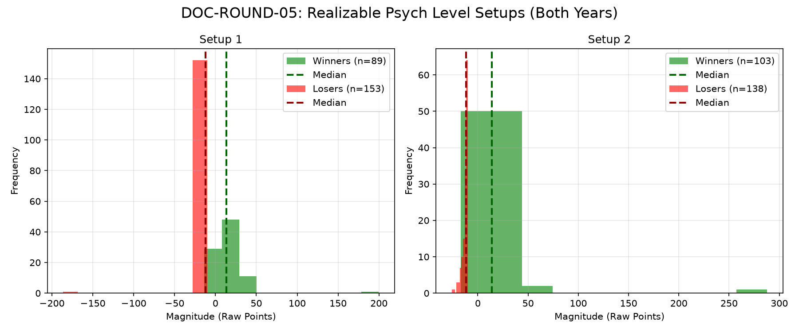

# Document ID: AG-DOC-ROUND-05 (LOGISTIC REGRESSION VERIFIED)
**Title:** Deep Dive #5: Psychological Round Numbers (00/50 Levels)
**Status:** Completed (Dual-Year Validated)
**Ruleset:** Bespoke Exit (Mean Revert to SMA20 or 10pt Stop). Unclamped Magnitude.

## LR: Unnormalized Expected Value (EV)
> *Note: Magnitudes are in raw points. Win Rate is binary (%).*

### Results for 2024
| Setup | Description | N | WR% | Mag (Mode) | EV (Mean Points) | EV 95% CI | Sig? |
|---|---|---|---|---|---|---|---|
| 1 | Bullish Bounce | 127 | 0.31 | -12.55 | **-3.19** | [-8.08, 1.96] | No |
| 2 | Bearish Bounce | 129 | 0.40 | -13.91 | **2.20** | [-2.12, 7.98] | No |

### Results for 2025
| Setup | Description | N | WR% | Mag (Mode) | EV (Mean Points) | EV 95% CI | Sig? |
|---|---|---|---|---|---|---|---|
| 1 | Bullish Bounce | 115 | 0.34 | -12.59 | **-2.51** | [-5.33, 0.34] | No |
| 2 | Bearish Bounce | 112 | 0.29 | -10.83 | **-3.77** | [-6.41, -1.00] | Yes |

## Graphical Descriptive Statistics (Aggregate)
