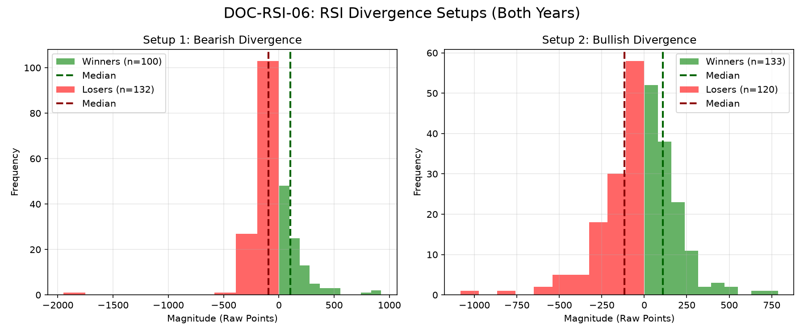

# Document ID: AG-DOC-RSI-06 (LOGISTIC REGRESSION VERIFIED)
**Title:** Deep Dive #06: RSI Divergence at Extremes
**Status:** Completed (Dual-Year Validated)
**Ruleset:** Bespoke Exit (RSI Opposite Extreme or EOD). Unclamped Magnitude.

## LR: Unnormalized Expected Value (EV)
> *Note: Magnitudes are in raw points. Win Rate is binary (%).*

### Results for 2024
| Setup | Description | N | WR% | Mag (Mode) | EV (Mean Points) | EV 95% CI | Sig? |
|---|---|---|---|---|---|---|---|
| 1 | Bearish Divergence (Short) | 127 | 0.43 | -67.91 | **-11.84** | [-38.75, 16.73] | No |
| 2 | Bullish Divergence (Long) | 131 | 0.54 | 31.50 | **-12.60** | [-45.14, 17.16] | No |

### Results for 2025
| Setup | Description | N | WR% | Mag (Mode) | EV (Mean Points) | EV 95% CI | Sig? |
|---|---|---|---|---|---|---|---|
| 1 | Bearish Divergence (Short) | 105 | 0.44 | -80.06 | **-8.09** | [-66.79, 41.81] | No |
| 2 | Bullish Divergence (Long) | 122 | 0.51 | -16.38 | **4.08** | [-38.99, 45.77] | No |

## Graphical Descriptive Statistics (Aggregate)
