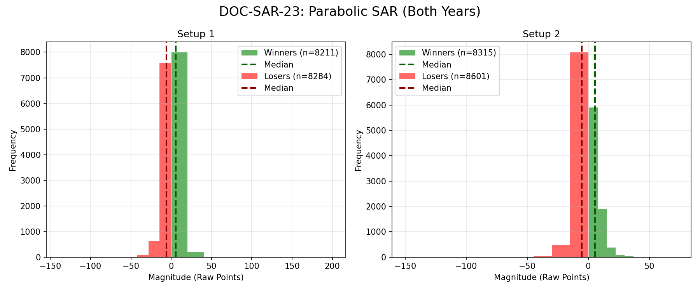

# Document ID: AG-DOC-SAR-23
**Title:** Deep Dive #23: Parabolic SAR Flip
**Status:** Completed (Dual-Year Validated)
**Ruleset:** Trend Flip 3.0$\sigma$ Target / 3.0$\sigma$ Stop.

## LR: Unnormalized Expected Value (EV)
> *Note: Magnitudes are in raw points. Win Rate is binary (%).*

### Results for 2024
| Setup | Description | N | WR% | Mag (Mode) | EV (Mean Points) | EV 95% CI | Sig? |
|---|---|---|---|---|---|---|---|
| 1 | Bullish Flip | 8838 | 0.50 | 4.34 | **-0.27** | [-0.41, -0.12] | Yes |
| 2 | Bearish Flip | 8970 | 0.49 | -4.56 | **-0.03** | [-0.17, 0.12] | No |

### Results for 2025
| Setup | Description | N | WR% | Mag (Mode) | EV (Mean Points) | EV 95% CI | Sig? |
|---|---|---|---|---|---|---|---|
| 1 | Bullish Flip | 7657 | 0.50 | -6.38 | **-0.15** | [-0.40, 0.10] | No |
| 2 | Bearish Flip | 7946 | 0.50 | -4.80 | **-0.03** | [-0.26, 0.20] | No |

## Graphical Descriptive Statistics (Aggregate)
