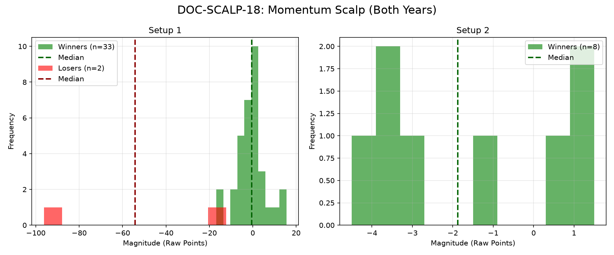

# Document ID: AG-DOC-SCALP-18 (LOGISTIC REGRESSION VERIFIED)
**Title:** Deep Dive #18: 1-Min Momentum Scalping (VWAP+EMA+RSI)
**Status:** Completed (Dual-Year Validated)
**Ruleset:** Bespoke Exit (Target VWAP or 10pt Stop). Unclamped Magnitude.

## LR: Unnormalized Expected Value (EV)
> *Note: Magnitudes are in raw points. Win Rate is binary (%).*

### Results for 2024
| Setup | Description | N | WR% | Mag (Mode) | EV (Mean Points) | EV 95% CI | Sig? |
|---|---|---|---|---|---|---|---|
| 1 | Long Scalp | 20 | 0.50 | 3.01 | **-1.20** | [-4.36, 1.88] | No |
| 2 | Short Scalp | 4 | 0.25 | -4.45 | **-2.10** | [-4.12, -0.12] | Yes |

### Results for 2025
| Setup | Description | N | WR% | Mag (Mode) | EV (Mean Points) | EV 95% CI | Sig? |
|---|---|---|---|---|---|---|---|
| 1 | Long Scalp | 15 | 0.27 | -1.26 | **-7.73** | [-21.87, 1.27] | No |
| 2 | Short Scalp | 4 | 0.50 | -3.70 | **-0.89** | [-3.25, 1.38] | No |

## Graphical Descriptive Statistics (Aggregate)
