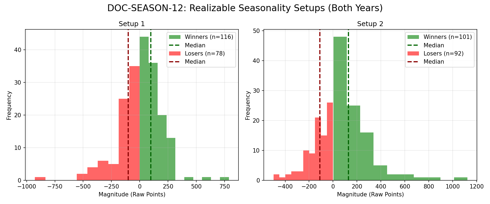

# Document ID: AG-DOC-SEASON-12 (LOGISTIC REGRESSION VERIFIED)
**Title:** Deep Dive #12: Seasonality / Day of Week Effects
**Status:** Completed (Dual-Year Validated)
**Ruleset:** Bespoke Exit (End of Day). Unclamped Magnitude.

## LR: Unnormalized Expected Value (EV)
> *Note: Magnitudes are in raw points. Win Rate is binary (%).*

### Results for 2024
| Setup | Description | N | WR% | Mag (Mode) | EV (Mean Points) | EV 95% CI | Sig? |
|---|---|---|---|---|---|---|---|
| 1 | Mon/Tue Bullish | 104 | 0.60 | 8.78 | **21.74** | [-8.73, 51.96] | No |
| 2 | Thu/Fri Bearish | 103 | 0.50 | 15.66 | **17.53** | [-17.93, 52.94] | No |

### Results for 2025
| Setup | Description | N | WR% | Mag (Mode) | EV (Mean Points) | EV 95% CI | Sig? |
|---|---|---|---|---|---|---|---|
| 1 | Mon/Tue Bullish | 90 | 0.60 | 16.54 | **15.74** | [-28.98, 60.72] | No |
| 2 | Thu/Fri Bearish | 90 | 0.54 | -125.15 | **50.46** | [-3.20, 104.77] | No |

## Graphical Descriptive Statistics (Aggregate)
