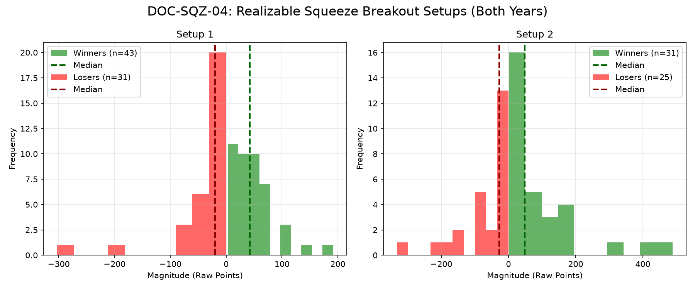

# Document ID: AG-DOC-SQZ-04 (LOGISTIC REGRESSION VERIFIED)
**Title:** Deep Dive #4: Volatility Squeeze Breakout Strategies
**Status:** Completed (Dual-Year Validated)
**Ruleset:** Bespoke Exit (Squeeze Returns ON or EOD). Unclamped Magnitude.

## LR: Unnormalized Expected Value (EV)
> *Note: Magnitudes are in raw points. Win Rate is binary (%).*

### Results for 2024
| Setup | Description | N | WR% | Mag (Mode) | EV (Mean Points) | EV 95% CI | Sig? |
|---|---|---|---|---|---|---|---|
| 1 | Bullish Squeeze Breakout | 44 | 0.55 | -1.47 | **10.11** | [-12.66, 29.95] | No |
| 2 | Bearish Squeeze Breakout | 26 | 0.54 | 1.55 | **4.95** | [-19.66, 29.04] | No |

### Results for 2025
| Setup | Description | N | WR% | Mag (Mode) | EV (Mean Points) | EV 95% CI | Sig? |
|---|---|---|---|---|---|---|---|
| 1 | Bullish Squeeze Breakout | 30 | 0.63 | 41.24 | **14.13** | [-7.41, 31.77] | No |
| 2 | Bearish Squeeze Breakout | 30 | 0.57 | -11.70 | **35.87** | [-21.98, 98.76] | No |

## Graphical Descriptive Statistics (Aggregate)
