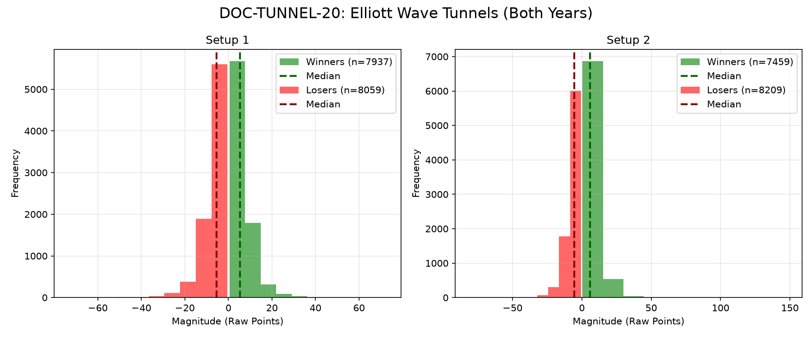

# Document ID: AG-DOC-TUNNEL-20
**Title:** Deep Dive #20: Elliott Wave Wavy Tunnels
**Status:** Completed (Dual-Year Validated)
**Ruleset:** Breakout Impulse 3.0$\sigma$ Target / 3.0$\sigma$ Stop.

## LR: Unnormalized Expected Value (EV)
> *Note: Magnitudes are in raw points. Win Rate is binary (%).*

### Results for 2024
| Setup | Description | N | WR% | Mag (Mode) | EV (Mean Points) | EV 95% CI | Sig? |
|---|---|---|---|---|---|---|---|
| 1 | Bullish Impulse | 8606 | 0.49 | 3.38 | **-0.18** | [-0.33, -0.04] | Yes |
| 2 | Bearish Impulse | 8340 | 0.48 | -3.40 | **-0.09** | [-0.26, 0.06] | No |

### Results for 2025
| Setup | Description | N | WR% | Mag (Mode) | EV (Mean Points) | EV 95% CI | Sig? |
|---|---|---|---|---|---|---|---|
| 1 | Bullish Impulse | 7390 | 0.50 | 3.97 | **-0.15** | [-0.38, 0.08] | No |
| 2 | Bearish Impulse | 7328 | 0.47 | -5.01 | **-0.25** | [-0.49, 0.00] | No |

## Graphical Descriptive Statistics (Aggregate)
