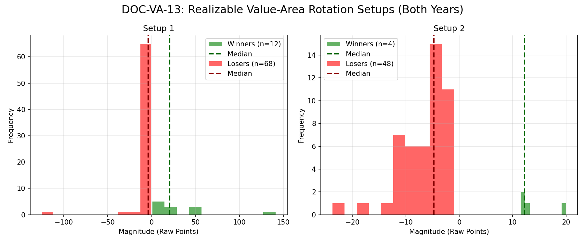

# Document ID: AG-DOC-VA-13 (LOGISTIC REGRESSION VERIFIED)
**Title:** Deep Dive #13: Value-Area Rotation Rules
**Status:** Completed (Dual-Year Validated)
**Ruleset:** Bespoke Exit (Target POC, Stop VA Boundary). Unclamped Magnitude.

## LR: Unnormalized Expected Value (EV)
> *Note: Magnitudes are in raw points. Win Rate is binary (%).*

### Results for 2024
| Setup | Description | N | WR% | Mag (Mode) | EV (Mean Points) | EV 95% CI | Sig? |
|---|---|---|---|---|---|---|---|
| 1 | Bearish Rotation (Setup 1) | 53 | 0.11 | -2.78 | **1.67** | [-3.31, 8.84] | No |
| 2 | Bullish Rotation (Setup 2) | 29 | 0.10 | -3.44 | **-2.85** | [-5.07, -0.21] | Yes |

### Results for 2025
| Setup | Description | N | WR% | Mag (Mode) | EV (Mean Points) | EV 95% CI | Sig? |
|---|---|---|---|---|---|---|---|
| 1 | Bearish Rotation (Setup 1) | 27 | 0.22 | -1.49 | **-5.06** | [-16.66, 3.83] | No |
| 2 | Bullish Rotation (Setup 2) | 23 | 0.04 | -10.71 | **-7.45** | [-10.14, -4.75] | Yes |

## Graphical Descriptive Statistics (Aggregate)
