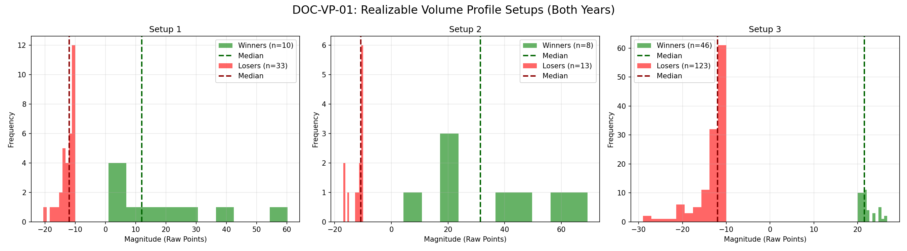

# Document ID: AG-DOC-VP-01 (LOGISTIC REGRESSION VERIFIED)
**Title:** Deep Dive #1: Volume Profile Trading Strategies
**Status:** Completed (Dual-Year Validated)
**Ruleset:** Bespoke Exit (Target VAH/VAL or 20pt/10pt Stop). Unclamped Magnitude.

## LR: Unnormalized Expected Value (EV)
> *Note: Magnitudes are in raw points. Win Rate is binary (%).*

### Results for 2024
| Setup | Description | N | WR% | Mag (Mode) | EV (Mean Points) | EV 95% CI | Sig? |
|---|---|---|---|---|---|---|---|
| 1 | Naked POC Test | 23 | 0.22 | -10.89 | **-5.24** | [-10.53, 1.13] | No |
| 2 | Naked POC Test | 14 | 0.36 | -9.94 | **0.05** | [-8.27, 9.59] | No |
| 3 | Trend Runner | 98 | 0.28 | -10.68 | **-3.07** | [-6.08, 0.21] | No |

### Results for 2025
| Setup | Description | N | WR% | Mag (Mode) | EV (Mean Points) | EV 95% CI | Sig? |
|---|---|---|---|---|---|---|---|
| 1 | Naked POC Test | 20 | 0.25 | -13.23 | **-5.60** | [-11.88, 3.26] | No |
| 2 | Naked POC Test | 7 | 0.43 | -16.14 | **17.80** | [-5.86, 47.00] | No |
| 3 | Trend Runner | 71 | 0.27 | -11.01 | **-4.14** | [-7.71, -0.39] | Yes |

## Graphical Descriptive Statistics (Aggregate)
