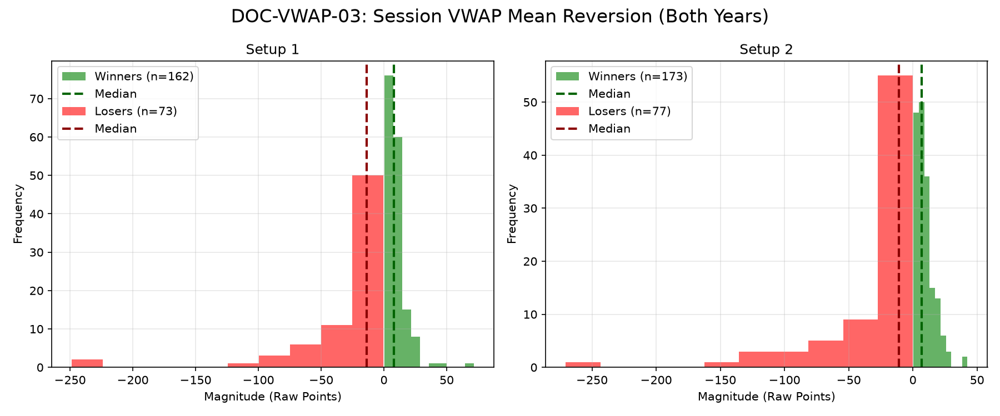

# Document ID: AG-DOC-VWAP-03 (LOGISTIC REGRESSION VERIFIED)
**Title:** Deep Dive #3: Session VWAP Z-Score Mean Reversion
**Status:** Completed (Dual-Year Validated)
**Ruleset:** Bespoke Exit (Mean Revert to VWAP or 3.0$\sigma$ Stop). Unclamped Magnitude.

## LR: Unnormalized Expected Value (EV)
> *Note: Magnitudes are in raw points. Win Rate is binary (%).*

### Results for 2024
| Setup | Description | N | WR% | Mag (Mode) | EV (Mean Points) | EV 95% CI | Sig? |
|---|---|---|---|---|---|---|---|
| 1 | Bullish Pullback | 125 | 0.77 | 4.71 | **-2.34** | [-9.09, 3.21] | No |
| 2 | Bearish Pullback | 133 | 0.71 | 5.94 | **-2.70** | [-8.79, 1.98] | No |

### Results for 2025
| Setup | Description | N | WR% | Mag (Mode) | EV (Mean Points) | EV 95% CI | Sig? |
|---|---|---|---|---|---|---|---|
| 1 | Bullish Pullback | 110 | 0.60 | 10.66 | **-1.96** | [-6.15, 2.04] | No |
| 2 | Bearish Pullback | 117 | 0.67 | 4.45 | **-1.95** | [-7.38, 2.91] | No |

## Graphical Descriptive Statistics (Aggregate)
