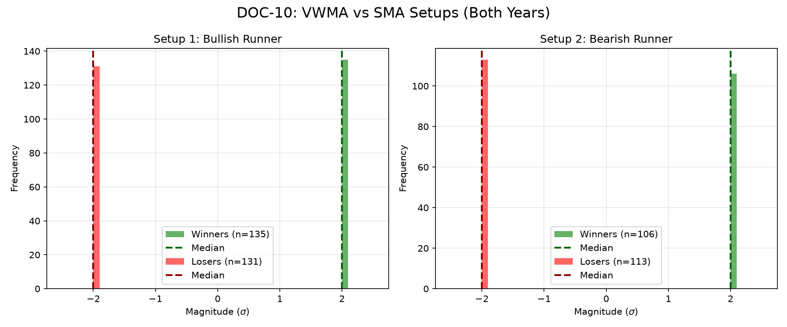

# Document ID: AG-DOC-10 (FABLE-5 VERIFIED)
**Title:** Deep Dive #10: VWMA vs SMA divergence
**Status:** Completed (Dual-Year Validated)
**Ruleset:** Symmetric 2.0$\sigma$ barriers. Open = 08:30 CT. MFE Clamped.

## PQ: Empirical Expectation (EV)
> *Note: For symmetric barriers ($\pm 2\sigma$), a random walk baseline expectation is a PF-WR of 0.00.*

### Results for 2024
| Setup | Description | N | PF-WR | Mag (Mode) | EV (Mean $\sigma$) | EV 95% CI | Sig? |
|---|---|---|---|---|---|---|---|
| 1 | Bullish Crossover | 145 | 0.16 | 1.95$\sigma$ | **0.15** | [-0.15, 0.46] | No |
| 2 | Bearish Crossover | 113 | -0.05 | -2.05$\sigma$ | **-0.05** | [-0.44, 0.30] | No |

### Results for 2025
| Setup | Description | N | PF-WR | Mag (Mode) | EV (Mean $\sigma$) | EV 95% CI | Sig? |
|---|---|---|---|---|---|---|---|
| 1 | Bullish Crossover | 121 | -0.11 | -2.05$\sigma$ | **-0.12** | [-0.48, 0.25] | No |
| 2 | Bearish Crossover | 106 | -0.07 | -2.05$\sigma$ | **-0.07** | [-0.45, 0.30] | No |

## Graphical Descriptive Statistics (Aggregate)
