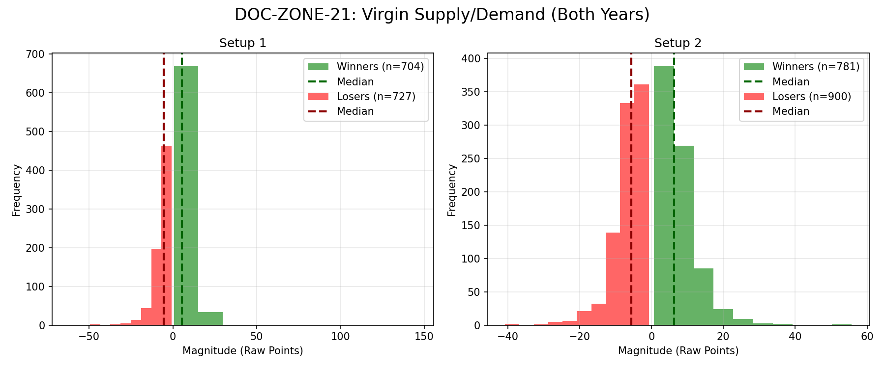

# Document ID: AG-DOC-ZONE-21
**Title:** Deep Dive #21: Virgin Supply & Demand Zones
**Status:** Completed (Dual-Year Validated)
**Ruleset:** Bounce Reversion 3.0$\sigma$ Target / 3.0$\sigma$ Stop.

## LR: Unnormalized Expected Value (EV)
> *Note: Magnitudes are in raw points. Win Rate is binary (%).*

### Results for 2024
| Setup | Description | N | WR% | Mag (Mode) | EV (Mean Points) | EV 95% CI | Sig? |
|---|---|---|---|---|---|---|---|
| 1 | Demand Zone Bounce | 642 | 0.48 | -4.50 | **-0.32** | [-0.87, 0.21] | No |
| 2 | Supply Zone Bounce | 762 | 0.45 | -4.16 | **-0.51** | [-1.03, 0.02] | No |

### Results for 2025
| Setup | Description | N | WR% | Mag (Mode) | EV (Mean Points) | EV 95% CI | Sig? |
|---|---|---|---|---|---|---|---|
| 1 | Demand Zone Bounce | 789 | 0.50 | 6.56 | **0.05** | [-0.65, 0.82] | No |
| 2 | Supply Zone Bounce | 919 | 0.48 | -5.68 | **0.07** | [-0.53, 0.67] | No |

## Graphical Descriptive Statistics (Aggregate)
