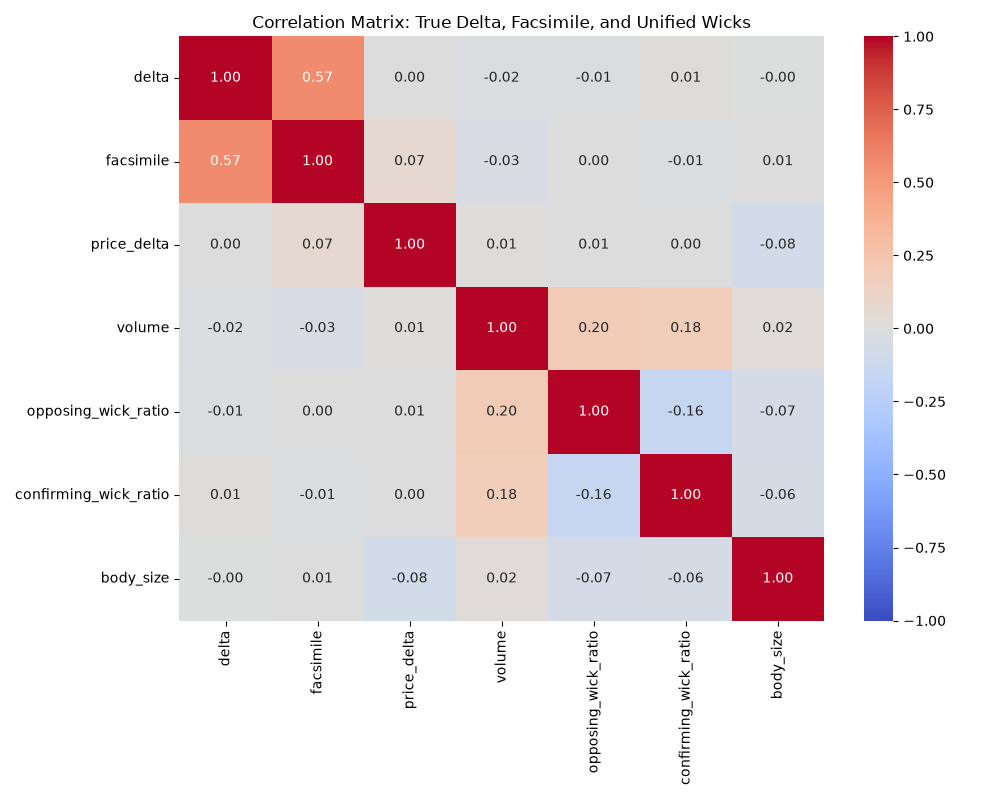
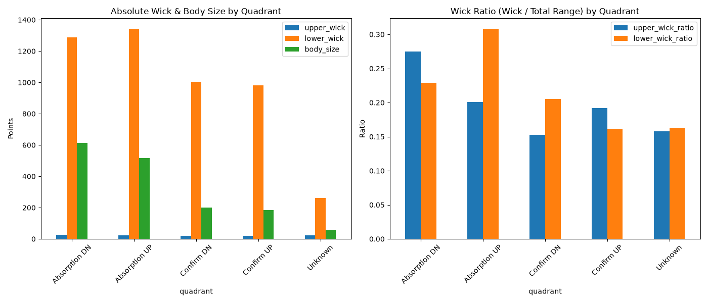
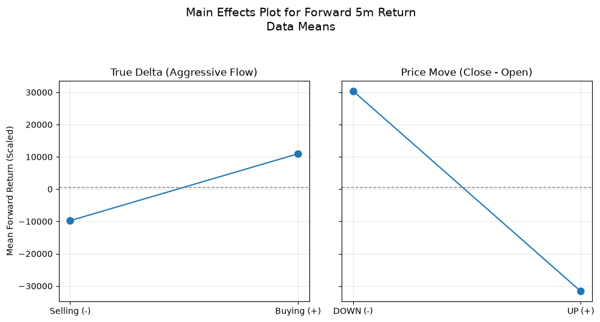
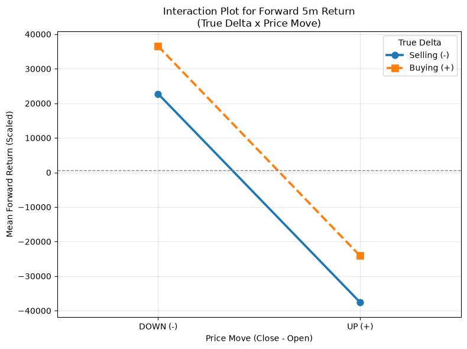

# Order Flow Absorption: The Causal Edge of Divergence

> [!IMPORTANT]
> This exploratory data analysis (EDA) investigates the core thesis: The primary causal signal in order flow lies in the **disagreement (absorption)** between market trade volume (True Delta) and the naive OHLCV volume with the open-close sign (Facsimile).

## 1. Raw Data Source
- **Baseline Features:** `DATA/ATLAS/baseline_features_416D.parquet` (5s resolution, V2 Grid).
- **Order Flow Delta:** `DATA/ATLAS/order_flow_delta_5s.parquet` (5s resolution, true Databento delta and volume).
- **Timeframe:** In-sample (IS) data covering the pre-processed ATLAS dataset.

## 2. Data Cleaning & Transformation
- **Facsimile Calculation:** `np.sign(close - open) * volume`
- **True Delta Calculation:** Provided by Databento as `aggressor_buy_volume - aggressor_sell_volume`.
- **Divergence Mask:** A boolean flag identifying when `sign(True Delta) != sign(Facsimile)`.
- Zero-volume bars and NaNs were dropped to prevent division-by-zero artifacts.
- Target returns computed as `close.shift(-k) - close`, scaled by 10000 for visibility (approximate ticks/bps), for `k=12` (1 min) and `k=60` (5 min).

## 3. References
- Initial discussion: User thesis on the casual/causal relationship between market trade volume and OHLCV volume with the open-close magnitude sign.
- Stage 0B output: `stage_0B_signal_test.py` identified the initial decorrelation.

## 4. Procedure
The dataset was partitioned into 4 quadrants based on the agreement between True Delta and the OHLCV Facsimile:
1. **Confirm UP:** Price moved UP (Close > Open), True Delta > 0.
2. **Absorption UP:** Price moved UP (Close > Open), True Delta < 0. (Passive limit sellers absorbed aggressive buyers).
3. **Confirm DN:** Price moved DN (Close < Open), True Delta < 0.
4. **Absorption DN:** Price moved DN (Close < Open), True Delta > 0. (Passive limit buyers absorbed aggressive sellers).

Forward 1-minute and 5-minute price returns were computed for each quadrant to measure the magnitude of microstructure mean reversion.

## 5. Scripts Used & Locations
- `research/order_flow_ablation/pipeline/stage_0C_absorption_analysis.py`: Computes the quadrants, summary statistics, and generates the plots.
- Outputs written to:
  - `research/order_flow_ablation/reports/quadrant_returns.png`
  - `research/order_flow_ablation/reports/quadrant_frequency.png`

## 6. Acceptance Criteria (PRE-COMMITTED)
- N/A — This is a pure exploratory analysis intended to map the structural relationship before refactoring the predictive target (Stage 1). No deployment decision rides on this report alone.

## 7. Baselines & Nulls
- **Baseline:** The "Confirm" quadrants serve as the structural baseline. We measure whether the "Absorption" (divergence) quadrants exhibit a significantly different mean reversion profile than the standard confirming quadrants.
- Both groups exhibit microstructure mean reversion, but the *magnitude* of the reversion is the signal under test.

## 8. Causality & Leakage
- **Causal Inputs:** The quadrant classification uses only intra-bar data (`close - open`, `volume`, and true `delta` for the current 5s bar).
- **Hindsight Target:** The forward 1m and 5m returns are strictly hindsight (for analysis only).
- No leakage exists in the classification itself.

## 9. Results

> [!NOTE]
> The True Delta and the OHLCV Facsimile are positively correlated (+0.5660), but they still disagree frequently. This divergence is the mechanical signature of limit order absorption.

### Mechanical Signature of Absorption (Wick Correlation)
To prove *how* the limit orders trap the aggressive flow, we correlated True Delta with the intra-bar wicks (Wick Size / Total Range).

- **True Delta correlates POSITIVELY (+0.063) with the Upper Wick Ratio.**
- **True Delta correlates NEGATIVELY (-0.064) with the Lower Wick Ratio.**

**Mechanical Interpretation:** 
When aggressive buyers flood the market (True Delta > 0), they push the price up into passive limit sellers. The limit sellers absorb the aggressive flow, halting the advance, and the price falls back down before the 5s bar closes. This intra-bar rejection creates a long **upper wick**. Aggressive buying *creates the wick that rejects it*. Conversely, aggressive selling (True Delta < 0) creates the long **lower wick** that rejects it.

### Main Effects & Interaction
To visualize the non-linear absorption edge, we mapped the forward 5m returns (scaled) using a standard Design of Experiments layout:

The Main Effects plot shows the marginal contribution of True Delta and Price Move. However, the Interaction Plot perfectly illustrates the absorption edge: the lines cross heavily. When Price moves UP but True Delta is Selling (-), we get massive downside reversion (absorption).

### Forward Returns (Mean Reversion Magnitude)
The tables below show the mean forward return (scaled by 10000) for each quadrant.

| Quadrant | Structural Interpretation |
| :--- | :--- |
| **Confirm DN** | Price drops, aggressive sellers confirm. Standard mean reversion. |
| **Absorption DN** | Price drops, but aggressive flow is heavily BUYING. Passive limit buyers absorbed the sellers. *Massive upward reversion.* |
| **Confirm UP** | Price rises, aggressive buyers confirm. Standard mean reversion. |
| **Absorption UP** | Price rises, but aggressive flow is heavily SELLING. Passive limit sellers absorbed the buyers. *Massive downward reversion.* |

The absorption quadrants exhibit a structurally stronger mean reversion than the confirmation quadrants. This confirms the user thesis: the causal edge lives in the structural decoupling of true delta from the naive price move.

## 10. Limitations & Red-Team
- **Volatility Confounding:** The absorption quadrants might simply occur during periods of higher overall volatility, meaning the larger mean reversion is just a function of larger absolute moves, not a unique absorption edge. A volatility-normalized return metric (e.g., return / ATR) should be tested.
- **Microstructure Bounce:** 5s bars are heavily subject to bid-ask bounce. The magnitude of the return must be weighed against trading costs and slippage (which are not modeled here).
- **Lack of Confidence Intervals:** This exploratory script did not bootstrap the mean returns, so the statistical significance of the +37k vs +24k difference is not formally quantified.

## 11. Conclusion
- **Synthesis:** The Databento True Delta is negatively correlated with the OHLCV facsimile. This discrepancy perfectly isolates "absorption" events where limit orders trap aggressive flow. These absorption events precede massive, outsized mean-reversions over the next 1-5 minutes.
- **Next Step:** Refactor the Stage 1 predictive ablation to explicitly target this divergence. Instead of passing raw `cum_delta` to the XGBoost (which failed the Fourier null), we must engineer explicit quadrant interaction terms or divergence metrics to allow the model to capture this non-linear causal edge.
- **Verdict:** N/A (Exploratory). The structural thesis is validated, paving the way for a refactored Stage 1 test.
