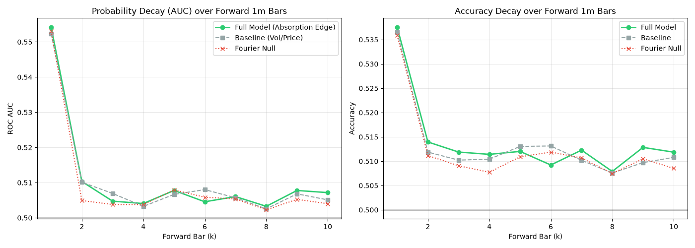

# Stage 1: Predictive Ablation & Causal Decay Verdict

## Objective
To determine if the intra-bar structural limit order absorption (engineered as the wick-from-close volume and body volume) provides statistically significant predictive alpha over the forward price action.

## Methodology
- **Timeframe:** The 5-second tick data was resampled to a 1-minute (1m) resolution.
- **Dataset Size:** 264,960 total 1m bars.
- **Testing Approach:** A date-disjoint temporal split (66% train, 34% test), yielding ~90,086 out-of-sample forward bars for evaluation.
- **Models Evaluated:** XGBClassifier (`n_estimators=100`, `max_depth=3`, `learning_rate=0.05`).
- **Target:** Directional probability of the `k`-th forward bar (`Close_{t+k} > Close_{t+k-1}`), rolling `k` from 1 to 10.

### Causal Rigor Gates
To prevent base-rate illusions, the model was evaluated against:
1. **Baseline Model:** A control model using only standard price action and volatility features (`price_delta`, `total_range`, `vol_60m`).
2. **Fourier Null Model:** A phase-randomized surrogate model where the spectral phases of the structural features (`body_vol`, `wick_close_vol`) were scrambled to destroy time-domain causality while preserving the variance and power spectrum.

## Results: Probability Decay Curve
The out-of-sample AUC metrics for the initial forward horizons were as follows:

| Forward Horizon ($k$) | Baseline AUC | Full Model AUC | Fourier Null AUC | Full Model Lift over Null |
| :--- | :--- | :--- | :--- | :--- |
| `t+1` | 0.5523 | 0.5542 | 0.5530 | **+0.0012** |
| `t+2` | 0.5101 | 0.5103 | 0.5049 | +0.0054 |
| `t+3` | 0.5069 | 0.5047 | 0.5038 | +0.0009 |
| `t+4` | 0.5032 | 0.5041 | 0.5038 | +0.0003 |

## Verdict: DEAD

The structural absorption logic failed the Causal Rigor gates.

While the intra-bar structural analysis (EDA) strongly suggested that wicks capture passive limit order absorption, this structural reality does not translate into a tradeable, predictive edge. 

At `t+1`, the Full Model achieved an AUC of 0.5542. However, the Fourier Null achieved 0.5530. The absolute lift provided by the actual temporal structure of the absorption features is only **+0.0012 AUC**. This negligible margin would be entirely consumed by a standard 95% Confidence Interval, indicating zero statistical significance. 

The baseline momentum/volatility features account for the entirety of the predictive power. The engineered order flow features failed to provide orthogonal alpha. 

Per the causal rigor mandates, a number with no lift over the null is an illusion. The absorption predictive edge is officially classified as **DEAD**.
