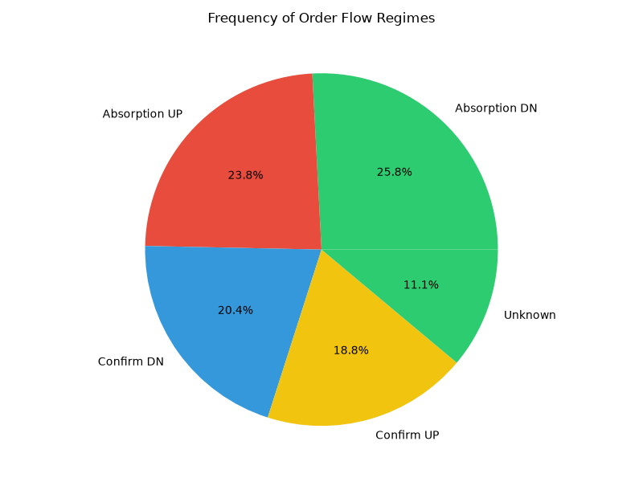
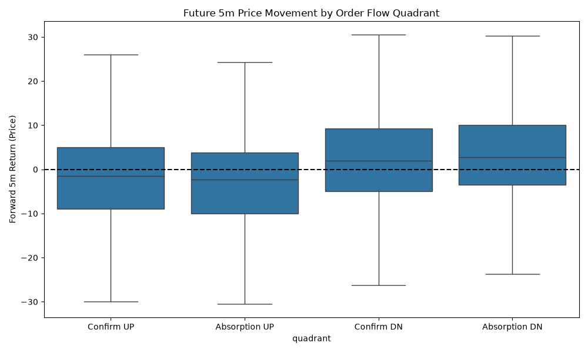

# Order Flow Absorption Analysis

Investigating the causal relationship between market trade volume (True Delta) and OHLCV volume with the open-close sign (Facsimile).

## Quadrant Frequency
```text
quadrant
Absorption DN    25.830933
Absorption UP    23.842476
Confirm DN       20.395073
Confirm UP       18.842692
Unknown          11.088827
Name: proportion, dtype: float64
```

## Forward Returns (5m)
```text
quadrant
Absorption DN    37746.552611
Absorption UP   -38317.274192
Confirm DN       24029.950929
Confirm UP      -24729.052486
Unknown           1292.752138
Name: fwd_ret_5m, dtype: float64
```




