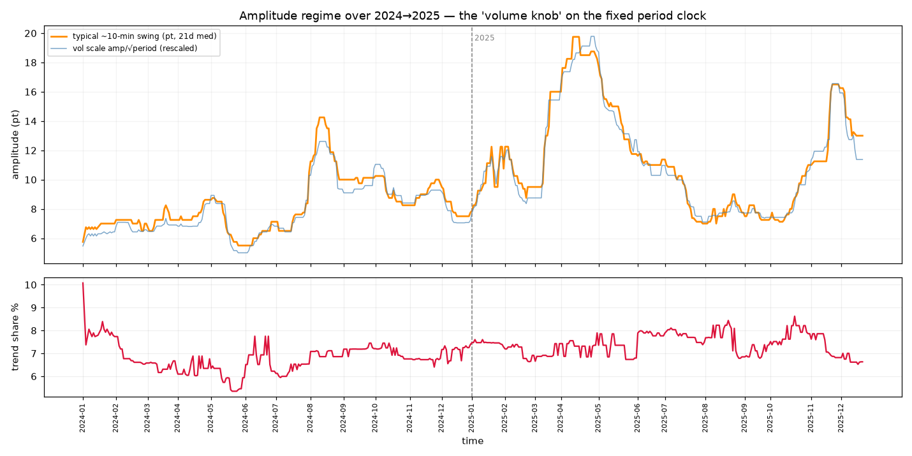

# Amplitude regime over time — the volume knob (2024→2025)
518 days, 21-day sliding median. Period is the fixed clock; this is how WIDE the oscillations are (the regime that sets the 'normal' envelope).



## Typical ~10-min swing amplitude (pt) over time
```
spark: ▁▁▁▁▁▁▁▁▁▁▁▁▁▁▁▁▁▁▁▁▁▁▁▁▁▁▁▁▁▁▁▁▁▁▁▁▁▁▁▁▁▁▁▁▁▁▁▁▁▁▁▁▁▁▂▂▂▂▁▁▁▁▁▁▁▁▁▁▁▁▁▁▁▁▁▁▁▂▂▂▂▂▂▂▂▂▂▂▂▂▂▂▂▂▁▁▁▁▁▁▁▁▁▁▁▁▁▁▁▁▁▁▁▁▁▁▁▁▁▁▁▁▁▁▁▁▁▁▁▁▁▁▁▁▁▁▁▁▁▁▁▂▂▂▂▂▂▂▂▂▃▃▃▄▄▄▅▅▅▅▅▅▄▄▄▄▄▃▃▃▃▃▃▃▃▃▃▃▃▃▃▃▃▃▃▃▃▃▃▃▃▃▃▃▃▃▃▃▃▃▃▂▂▂▂▂▂▂▂▂▂▂▂▂▂▂▂▂▂▂▂▂▂▂▂▂▂▂▂▂▂▃▃▃▃▃▃▃▂▂▂▂▂▂▂▂▂▂▁▁▁▁▁▁▁▁▁▂▂▂▂▂▂▂▂▂▃▃▃▃▃▄▃▂▂▂▃▄▄▃▄▄▄▃▃▃▃▃▃▃▃▃▂▂▂▂▂▂▂▂▂▂▂▂▂▃▄▄▄▄▆▆▆▆▆▆▆▆▆▆▆▇▇▇▇█████▇▇▇▇▇▇▇▇▇▇▇▇▇▆▆▆▅▅▅▅▅▅▅▅▅▅▅▅▄▄▄▄▄▄▄▄▄▄▄▄▄▃▃▃▃▃▃▃▃▃▃▃▃▃▃▃▃▃▃▃▃▃▃▃▃▃▃▃▃▃▂▂▂▂▁▁▁▁▁▁▁▁▁▁▁▁▁▁▂▂▁▁▁▁▁▂▁▂▂▂▂▂▂▂▂▂▂▂▂▁▁▂▂▂▂▂▂▂▂▁▁▁▁▁▁▁▁▂▁▁▁▁▁▁▁▁▁▂▂▂▂▂▂▂▂▃▃▃▃▃▃▃▃▃▃▃▃▃▃▃▃▃▃▃▄▅▆▆▆▆▆▆▆▆▆▆▅▅▅▅▄▄▄▄▄▄▄▄
range 6 → 20 pt  | 2024 median 8pt vs 2025 median 11pt
```
## Trend share (no-return) over time
```
spark: █▅▃▄▅▄▄▄▄▄▄▄▅▅▅▄▅▄▄▄▄▄▄▄▃▃▃▃▃▃▃▃▂▂▂▂▂▂▂▂▂▂▂▂▂▂▂▂▂▂▂▂▂▂▂▂▂▂▂▂▂▂▂▂▂▂▂▂▂▂▂▂▂▃▂▁▂▃▂▃▂▂▂▂▃▂▂▂▂▂▂▂▁▁▁▁▁▁▁▁▁▁▁▁▁▁▁▁▂▂▃▃▃▃▄▃▂▂▃▃▃▄▃▄▂▂▂▂▂▂▁▁▁▁▁▁▂▂▂▂▂▂▂▂▂▂▂▂▂▂▂▃▃▃▃▃▃▃▃▃▃▃▃▃▃▃▃▃▃▃▃▃▃▃▃▃▃▃▃▃▃▃▃▃▃▃▃▃▃▃▄▄▃▃▃▃▃▃▃▄▄▃▃▄▃▃▃▃▃▃▃▃▃▃▃▃▃▃▃▃▃▃▃▃▃▃▃▃▃▃▃▃▃▂▃▃▃▃▃▃▃▃▂▂▂▃▃▃▃▃▃▂▃▃▃▃▃▄▄▄▄▄▄▄▄▄▄▄▄▄▄▄▄▄▄▄▄▄▄▃▃▃▃▃▃▄▃▄▄▃▃▃▃▃▃▂▂▂▃▃▂▃▃▃▃▃▃▃▃▃▃▃▃▄▄▃▄▄▄▃▃▄▄▄▄▄▃▃▃▃▃▃▃▃▃▃▃▃▃▃▃▄▃▄▄▃▃▃▃▃▃▄▄▃▃▃▃▃▃▃▃▃▃▃▃▃▃▃▄▄▄▄▄▄▄▄▄▄▄▄▄▄▄▄▄▄▄▄▄▄▅▄▄▄▄▄▄▄▄▄▄▄▄▄▄▄▄▄▄▄▄▄▄▄▄▄▄▄▅▄▅▅▅▄▄▅▅▅▅▅▅▃▅▃▃▃▃▃▃▃▃▃▃▃▄▄▃▃▃▃▃▃▄▃▃▄▄▄▄▄▄▄▄▄▄▄▄▅▄▄▅▅▅▅▅▅▄▄▅▅▄▄▄▄▄▄▄▄▄▄▄▄▄▃▃▃▃▃▃▃▃▃▃▃▃▃▃▃▃▂▂▂▂▂▂▂▂▂
range 5% → 10%
```

## Read (START of a framework, not the framework)
Amplitude is non-stationary where period is constant: the 'normal swing size' breathes by regime.
A LIVE causal estimate of this scale would set the expectation envelope — what oscillation is
normal/acceptable right now, and what excursion is abnormal (a regime widening or a runaway). That
causal estimator + validation that breaching the envelope predicts the runaway = the unbuilt rest.
