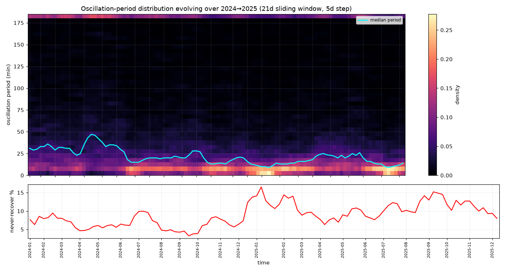

# Oscillation-period evolution (2024→2025, sliding window)
21-day window, 5-day step, 104 windows, 79388 pooled oscillations.



## Median oscillation period over time (min)
```
sparkline: ▅▄▄▅▅▅▅▄▅▅▅▅▄▃▃▅▇█▇▇▆▅▅▅▅▄▄▂▂▂▂▂▂▃▃▃▂▃▃▃▃▃▃▃▃▄▄▄▃▂▁▁▁▁▁▂▂▃▃▃▂▁▁▁▁▁▁▁▁▁▁▁▁▁▂▂▂▂▂▃▃▃▃▃▃▃▃▃▃▃▃▄▃▂▂▁▁▁▁▁▁▁▁▁
range: 9 → 47 min  (start 31, end 14)
```
## Never-recover rate over time (%)
```
sparkline: ▃▂▃▃▃▄▃▃▃▃▂▁▁▁▂▂▂▂▂▂▂▂▂▃▄▄▄▃▂▁▁▁▁▁▁▁▁▁▂▂▃▃▃▃▂▂▂▃▅▆▆█▆▅▄▅▆▆▆▄▃▄▄▃▃▂▃▃▂▄▃▄▄▄▃▃▃▃▄▅▅▅▄▄▄▄▅▆▆▇▇▆▅▄▆▅▅▅▅▄▅▄▄▃
range: 3% → 17%
```

## Biggest period transitions (window-over-window median shift)
- 2024-04 → 2024-05: 25 → 35 min  (Δ+10)
- 2024-07 → 2024-07: 27 → 18 min  (Δ-9)
- 2024-05 → 2024-05: 35 → 43 min  (Δ+8)
- 2024-12 → 2024-12: 27 → 20 min  (Δ-7)
- 2025-09 → 2025-10: 26 → 20 min  (Δ-6)
- 2024-12 → 2024-12: 20 → 15 min  (Δ-5)

## Read
If the median wanders and jumps, the recovery clock is non-stationary -> a fixed cut-time is
wrong; the cut-threshold must track the CURRENT window's period. The heatmap's bright band is
the live oscillation timescale; the red panel flags regimes where wrong trades stop coming back.
