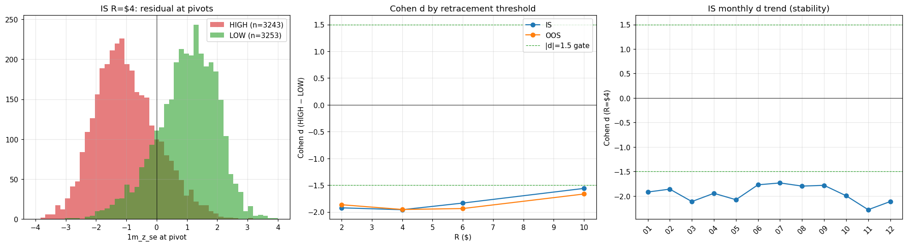

# Cohen d verification at RM zigzag pivots

Generated: 2026-04-22T05:05:44
Ref: `research/rm_pivot/cycle_01.md`

## Method

- Rolling 60-bar OLS on 1m closes → RM series
- Live-safe zigzag on RM (confirmation-only, no lookahead)
- Pivot type + residual (`1m_z_se`) at confirmation bar + next-leg direction
- Cohen d: residual distribution HIGH pivots vs LOW pivots
- Accuracy: residual-sign predicts next-leg (mean-reversion rule)

## Pooled results (all days)

| R ($) | Cohort | N pivots | N HIGH | N LOW | mean_HIGH | mean_LOW | Cohen d | Accuracy |
|---:|---|---:|---:|---:|---:|---:|---:|---:|
| $2 | IS | 9522 | 4761 | 4761 | -0.960 | +0.983 | **-1.92** | 17.2% |
| $2 | OOS | 2590 | 1298 | 1292 | -0.929 | +0.965 | **-1.87** | 18.7% |
| $4 | IS | 6496 | 3243 | 3253 | -0.993 | +0.988 | **-1.96** | 16.5% |
| $4 | OOS | 1842 | 921 | 921 | -0.991 | +0.996 | **-1.95** | 16.5% |
| $6 | IS | 4545 | 2267 | 2278 | -0.939 | +0.952 | **-1.83** | 18.2% |
| $6 | OOS | 1377 | 686 | 691 | -0.971 | +0.978 | **-1.94** | 16.3% |
| $10 | IS | 2562 | 1273 | 1289 | -0.791 | +0.858 | **-1.56** | 21.7% |
| $10 | OOS | 818 | 408 | 410 | -0.910 | +0.836 | **-1.67** | 20.9% |

## IS monthly walk-forward

Stability check: does |d| hold month-to-month, or is it a pooled-average illusion?

### R = $2

| Month | N | Cohen d | Accuracy |
|---|---:|---:|---:|
| 2025_01 | 872 | -1.97 | 16.6% |
| 2025_02 | 749 | -1.86 | 18.0% |
| 2025_03 | 688 | -1.94 | 17.6% |
| 2025_04 | 1090 | -1.50 | 23.0% |
| 2025_05 | 938 | -2.19 | 14.6% |
| 2025_06 | 603 | -1.95 | 16.4% |
| 2025_07 | 793 | -1.96 | 17.5% |
| 2025_08 | 812 | -2.00 | 15.4% |
| 2025_09 | 503 | -2.16 | 14.9% |
| 2025_10 | 896 | -2.06 | 15.5% |
| 2025_11 | 939 | -1.93 | 16.7% |
| 2025_12 | 639 | -1.85 | 18.0% |
| **std(d)** |  | **0.17** |  |
| **mean(d)** |  | **-1.95** |  |

### R = $4

| Month | N | Cohen d | Accuracy |
|---|---:|---:|---:|
| 2025_01 | 585 | -1.92 | 18.1% |
| 2025_02 | 490 | -1.86 | 19.0% |
| 2025_03 | 504 | -2.11 | 14.3% |
| 2025_04 | 817 | -1.95 | 16.4% |
| 2025_05 | 683 | -2.08 | 16.3% |
| 2025_06 | 421 | -1.77 | 17.8% |
| 2025_07 | 485 | -1.73 | 17.5% |
| 2025_08 | 521 | -1.80 | 17.5% |
| 2025_09 | 312 | -1.78 | 17.6% |
| 2025_10 | 585 | -2.00 | 15.9% |
| 2025_11 | 672 | -2.28 | 13.7% |
| 2025_12 | 421 | -2.11 | 15.4% |
| **std(d)** |  | **0.16** |  |
| **mean(d)** |  | **-1.95** |  |

### R = $6

| Month | N | Cohen d | Accuracy |
|---|---:|---:|---:|
| 2025_01 | 399 | -1.75 | 18.5% |
| 2025_02 | 339 | -1.87 | 18.9% |
| 2025_03 | 376 | -2.12 | 14.6% |
| 2025_04 | 640 | -1.86 | 17.3% |
| 2025_05 | 455 | -1.96 | 17.6% |
| 2025_06 | 291 | -1.78 | 18.9% |
| 2025_07 | 286 | -1.46 | 21.3% |
| 2025_08 | 357 | -1.58 | 23.0% |
| 2025_09 | 187 | -1.24 | 26.2% |
| 2025_10 | 418 | -1.93 | 17.0% |
| 2025_11 | 495 | -2.13 | 15.2% |
| 2025_12 | 302 | -1.99 | 16.2% |
| **std(d)** |  | **0.25** |  |
| **mean(d)** |  | **-1.81** |  |

### R = $10

| Month | N | Cohen d | Accuracy |
|---|---:|---:|---:|
| 2025_01 | 277 | -1.58 | 22.4% |
| 2025_02 | 200 | -1.61 | 19.0% |
| 2025_03 | 214 | -1.65 | 20.6% |
| 2025_04 | 454 | -1.79 | 18.9% |
| 2025_05 | 236 | -1.45 | 23.3% |
| 2025_06 | 158 | -1.57 | 21.5% |
| 2025_07 | 104 | -0.75 | 37.5% |
| 2025_08 | 175 | -1.24 | 24.0% |
| 2025_09 | 41 | -1.83 | 19.5% |
| 2025_10 | 228 | -1.63 | 21.1% |
| 2025_11 | 303 | -1.75 | 19.5% |
| 2025_12 | 172 | -1.45 | 23.8% |
| **std(d)** |  | **0.28** |  |
| **mean(d)** |  | **-1.52** |  |

## Chart



## Reproduction

```
python tools/measure_rm_pivot_direction_cohen_d.py
```
