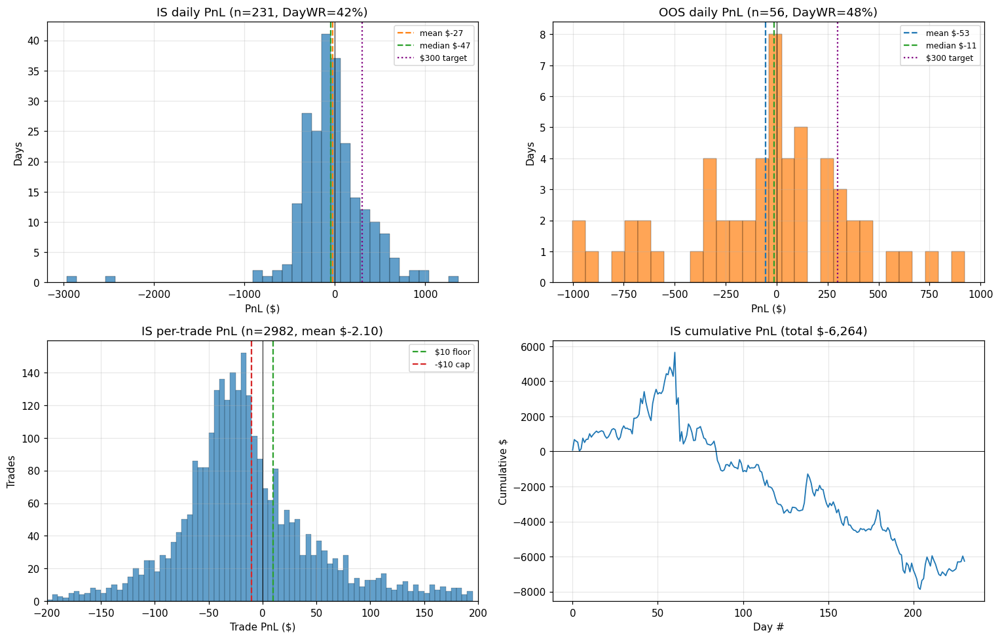

# RM Pivot Forward Pass — Cycle 02

Generated: 2026-04-22T05:10:51
Ref: `research/rm_pivot/cycle_02.md`

## Rules

- Entry: confirmed RM zigzag pivot at R=$4 (60-bar rolling OLS on 1m closes)
- Direction: LOW pivot → LONG, HIGH pivot → SHORT
- Exit: next RM pivot confirms
- EOD force-close at 20:55 UTC; no stop-loss, no take-profit, no max-hold
- One position at a time (no chains in v1)
- PnL: 1m close at pivot confirmation × $2/pt (1s slippage deferred to Control)

## IS (2025)

**Trades**: 2,982 over 231 days (12.9/day)
**Total PnL**: $-6,264  (-27.12/day mean)

### Daily distribution

| mean | median | p5 | p25 | p75 | p95 | min | max | std | DayWR |
|---:|---:|---:|---:|---:|---:|---:|---:|---:|---:|
| $-27 | $-47 | $-470 | $-230 | $+147 | $+594 | $-2,966 | $+1,366 | $413 | **42%** |

**Daily mode bucket**: [$-75..$-50) — 17 days (7%)

### Per-trade

| mean | median | count-WR | **Trade-WR (PnL ratio)** | %≥$10 net | %≤-$10 |
|---:|---:|---:|---:|---:|---:|
| $-2.10 | $-20.00 | 34% | **-0.06** | 30% | 10% (noise band) |

**Trade mode bucket (\$5)**: [$-20..$-15) — 152 trades (5%)
**Gross win**: $+95,038  |  **Gross loss**: $-101,302
**Largest win/loss**: $+885 / $-877
**Hold**: mean 37 min, median 32 min

## OOS (2026)

**Trades**: 846 over 56 days (15.1/day)
**Total PnL**: $-2,978  (-53.19/day mean)

### Daily distribution

| mean | median | p5 | p25 | p75 | p95 | min | max | std | DayWR |
|---:|---:|---:|---:|---:|---:|---:|---:|---:|---:|
| $-53 | $-11 | $-794 | $-282 | $+258 | $+566 | $-1,000 | $+922 | $420 | **48%** |

**Daily mode bucket**: [$-25..$+0) — 5 days (9%)

### Per-trade

| mean | median | count-WR | **Trade-WR (PnL ratio)** | %≥$10 net | %≤-$10 |
|---:|---:|---:|---:|---:|---:|
| $-3.52 | $-22.50 | 33% | **-0.10** | 29% | 11% (noise band) |

**Trade mode bucket (\$5)**: [$-15..$-10) — 40 trades (5%)
**Gross win**: $+27,400  |  **Gross loss**: $-30,378
**Largest win/loss**: $+775 / $-252
**Hold**: mean 35 min, median 30 min

## Comparison vs success criteria (from cycle_02.md PLAN)

| Metric | Gate | Actual (IS) | Pass |
|---|---|---:|---:|
| Trades/day | >= 20 | +12.91 | ✗ |
| Trade WR (PnL ratio) | >= 0.5 | -0.06 | ✗ |
| Mode $/trade bucket low | >= 10 | -20.00 | ✗ |
| Mean $/trade | >= 10 | -2.10 | ✗ |
| Daily mean PnL | >= 200 | -27.12 | ✗ |
| Daily median PnL | >= 100 | -47.00 | ✗ |
| Day WR (%) | >= 60 | +42.42 | ✗ |

## Reproduction

```
python tools/forward_pass_rm_pivot.py
```

## Chart


